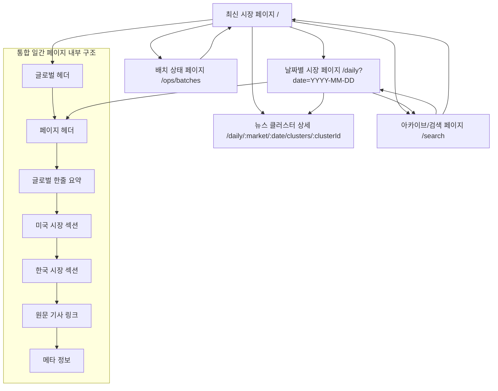

# 정보 구조도(IA)

## 화면 간 관계

## IA 표

| 화면 ID | Depth 1 | Depth 2 | Depth 3 | Depth 4(필요시) | 화면명 | 기능 상세 및 설명 | 참고 문서(P/U/W) |
| --- | --- | --- | --- | --- | --- | --- | --- |
| COM-01 | (공통) | 글로벌 레이아웃 | 글로벌 헤더 |  | 글로벌 헤더 | 서비스명 노출, 최신 시장 페이지 이동, 날짜 퀵 네비게이션 진입, 미국/한국 전환용 시장 탭 또는 섹션 점프, 아카이브/검색 이동, 운영용 Ops 진입, 현재 페이지와 무관하게 공통 탐색 제공 | U, W |
| COM-02 | (공통) | 글로벌 레이아웃 | 사이드 네비게이션 |  | 보조 탐색 메뉴 | 최신 시장 페이지, 날짜별 시장 페이지, Search, 배치 상태 페이지로 이동하는 보조 메뉴 제공, 최신 시장 페이지에서는 보조 탐색 비중을 낮게 유지, 운영 페이지는 권한 조건에 따라 노출 제어 | W |
| HOM-01 | 시장 브리핑 | 최신 시장 | 통합 개요 |  | 최신 시장 페이지 | 가장 최근 생성된 통합 일간 페이지 자동 로드, 미국/한국 시장 결과를 한 화면에서 함께 제공, 첫 진입 시 10~20초 내 전체 시장 흐름 파악을 목표로 함, 최신 데이터 없음 시 Empty 상태와 대체 이동 CTA 제공 | P, U, W |
| HOM-02 | 시장 브리핑 | 최신 시장 | 통합 개요 | 페이지 헤더 | 최신 페이지 헤더 | 페이지 제목, 기준일(`business_date`), 생성 시각(`generated_at`), 상태 배지(`READY`, `PARTIAL`) 표시, 기준일과 생성 시각을 분리 표기, 데이터 누락 시 상단 경고 배너 노출 | P, U, W |
| HOM-03 | 시장 브리핑 | 최신 시장 | 통합 개요 | 글로벌 헤드라인 | 글로벌 한줄 요약 배너 | 미국/한국 전체 시장을 묶는 핵심 한줄 요약 표시, 필요 시 보조 설명 문구 포함, 페이지 내 최상위 시각 우선순위 유지, 스켈레톤 및 부분 실패 상태에서도 우선 노출 | P, U, W |
| HOM-04 | 시장 브리핑 | 최신 시장 | 빠른 탐색 |  | 퀵 점프/날짜 이동 | 미국 시장으로 이동, 한국 시장으로 이동, Search 이동, 날짜별 페이지 진입 등 빠른 탐색 기능 제공, 키보드 탐색 순서는 날짜 탐색 후 시장 섹션 순서로 구성 | W |
| HOM-US-01 | 시장 브리핑 | 최신 시장 | 미국 시장 섹션 | 섹션 헤더 | 미국 시장 요약 섹션 | 미국 증시 일간 요약 제목과 섹션 구분 제공, 통합 페이지 내 첫 번째 시장 섹션으로 배치, 상단 요약과 연결된 맥락으로 미국 지수/뉴스/해설을 순차 노출 | P, U, W |
| HOM-US-02 | 시장 브리핑 | 최신 시장 | 미국 시장 섹션 | 대표 지수 카드 | 미국 대표 지수 카드 영역 | NASDAQ, S&P 500, DOW JONES 등 3개 이상 카드 표시, 지수명, 종가, 등락값, 등락률, 장중 고가/저가, 상승·하락 시각 상태를 제공, 일부 지수 누락 시 Partial 문구 또는 배지 표시 | P, U, W |
| HOM-US-03 | 시장 브리핑 | 최신 시장 | 미국 시장 섹션 | 핵심 뉴스 카드 | 미국 핵심 뉴스 카드 목록 | 클러스터 단위 핵심 뉴스 3~5건 노출, 대표 제목, AI 요약 2~3줄, 관련 기사 수, 태그, 대표 링크 버튼, 상세 보기 버튼 제공, 카드 클릭 시 상세 패널 또는 상세 페이지 이동, AI 요약 실패 시 `요약 미생성` 및 원문 링크 우선 제공 | P, U, W |
| HOM-US-04 | 시장 브리핑 | 최신 시장 | 미국 시장 섹션 | 시장 해설 | 미국 시장 해설 영역 | 상승/하락 배경, 주요 테마, 다음 관전 포인트를 3분할 또는 단락형으로 제공, 긴 문장은 접기 처리 가능, 지수와 뉴스 요약을 해설 문맥으로 연결 | P, U, W |
| HOM-KR-01 | 시장 브리핑 | 최신 시장 | 한국 시장 섹션 | 섹션 헤더 | 한국 시장 요약 섹션 | 한국 증시 일간 요약 제목과 섹션 구분 제공, 미국 섹션 다음에 배치하여 양 시장 비교 흐름 유지, 한국 지수/뉴스/해설을 연속 탐색 가능하게 구성 | P, U, W |
| HOM-KR-02 | 시장 브리핑 | 최신 시장 | 한국 시장 섹션 | 대표 지수 카드 | 한국 대표 지수 카드 영역 | KOSPI, KOSDAQ 등 2개 이상 카드 표시, 지수명, 종가, 등락값, 등락률, 고가/저가, 상승·하락 상태 제공, 일부 데이터 누락 시 해당 시장 섹션 상단에 누락 배지 노출 | P, U, W |
| HOM-KR-03 | 시장 브리핑 | 최신 시장 | 한국 시장 섹션 | 핵심 뉴스 카드 | 한국 핵심 뉴스 카드 목록 | 클러스터 기준 3~5건 노출, 대표 제목, 요약, 태그, 관련 기사 수, 대표 링크, 상세 보기 제공, 사용자는 핵심 이슈를 카드 단위로 훑고 상세로 진입 가능 | P, U, W |
| HOM-KR-04 | 시장 브리핑 | 최신 시장 | 한국 시장 섹션 | 시장 해설 | 한국 시장 해설 영역 | 한국 시장의 상승/하락 배경, 주요 테마, 다음 관전 포인트 제공, 미국 섹션과 동일한 정보 구조를 유지해 시장 간 비교 용이성 확보 | P, U, W |
| HOM-05 | 시장 브리핑 | 최신 시장 | 하단 정보 | 원문 기사 링크 | 통합 원문 기사 링크 영역 | 기사 제목, 언론사명, 발행 시각, 시장 구분, 연결 이슈명, 링크 타입(원문/네이버)을 리스트형으로 제공, 기사 링크는 새 탭으로 열리며 뉴스 카드의 출처 검증 수단 역할 수행 | P, U, W |
| HOM-06 | 시장 브리핑 | 최신 시장 | 하단 정보 | 메타 정보 | 메타 정보 카드 | 수집 기사 수, 정제 기사 수, 핵심 이슈 수, 마지막 업데이트 시각 등 페이지 생성 메타 정보를 제공, 품질·신뢰성 판단을 위한 보조 정보로 사용 | P, U, W |
| HOM-07 | 시장 브리핑 | 최신 시장 | 상태 처리 |  | 최신 페이지 상태 처리 | Loading 시 헤드라인/지수/뉴스/링크 스켈레톤 노출, Empty 시 최신 페이지 없음 메시지와 Search 이동 CTA 제공, Partial 시 누락 경고 배너와 시장별 누락 배지 제공, Error 시 재시도와 마지막 성공 페이지 링크 제공 | P, U, W |
| DAY-01 | 시장 브리핑 | 날짜별 시장 | 조회 조건 |  | 날짜별 시장 페이지 | 특정 날짜의 통합 시장 페이지를 조회하는 화면, 최신 페이지와 동일한 스냅샷 템플릿을 그대로 재사용하며 날짜만 바뀌는 구조를 기본으로 함, 사용자는 오늘 화면과 동일한 방식으로 과거 페이지를 비교·복기할 수 있어야 함 | P, U, W |
| DAY-02 | 시장 브리핑 | 날짜별 시장 | 조회 조건 | 날짜 선택 | 날짜 선택 바 | 날짜 선택 UI, 조회 버튼, 이전 날짜 버튼, 다음 날짜 버튼 제공, 미래 날짜 선택 시 검증 에러 표시, 명시적 조회 방식으로 사용자가 요청 시점과 결과를 인지할 수 있게 설계 | U, W |
| DAY-03 | 시장 브리핑 | 날짜별 시장 | 조회 조건 | 컨텍스트 배너 | 날짜 컨텍스트 안내 | 선택한 날짜의 미국/한국 통합 시장 페이지를 보여준다는 설명 배너 제공, 사용자가 최신 화면과 날짜 조회 화면의 차이를 인지하도록 지원 | W |
| DAY-04 | 시장 브리핑 | 날짜별 시장 | 조회 결과 | 통합 결과 본문 | 날짜별 통합 시장 결과 | 글로벌 한줄 요약, 미국 지수 카드, 미국 핵심 뉴스 카드, 미국 시장 해설, 한국 지수 카드, 한국 핵심 뉴스 카드, 한국 시장 해설, 통합 원문 기사 링크, 메타 정보를 최신 페이지와 동일한 순서와 정보 밀도로 렌더링, 최신 화면과의 직접 비교가 가능해야 함 | P, U, W |
| DAY-05 | 시장 브리핑 | 날짜별 시장 | 상태 처리 | Empty/Partial/Error | 날짜별 조회 상태 처리 | 해당 날짜 데이터 없음 시 Empty 문구와 이전 날짜·최신 페이지·Search 이동 CTA 제공, Partial 시 일부 시장 또는 카드에 `데이터 누락` 배지 표시, Error 시 입력값 유지 후 재시도 제공 | P, U, W |
| CLU-01 | 뉴스 상세 | 뉴스 클러스터 상세 | 상세 개요 |  | 뉴스 클러스터 상세 페이지 | 최신 페이지 또는 날짜별 페이지의 뉴스 카드에서 진입하는 상세 화면, 클러스터 단위 이슈의 맥락과 관련 기사 묶음을 심화 탐색하는 독립 화면 또는 패널 | U, W |
| CLU-02 | 뉴스 상세 | 뉴스 클러스터 상세 | 상세 개요 | 브레드크럼 | 상세 경로 표시 | 시장명, 기준일, 뉴스 클러스터 상세로 이어지는 브레드크럼 제공, 사용자가 어느 시장과 날짜 문맥에서 진입했는지 이해하도록 지원 | W |
| CLU-03 | 뉴스 상세 | 뉴스 클러스터 상세 | 상세 본문 | 핵심 정보 | 클러스터 헤더 | 대표 제목과 키워드 태그 노출, 태그는 관련 주제를 빠르게 파악하도록 보조, 페이지 최상단에서 이슈 정체성을 명확히 전달 | U, W |
| CLU-04 | 뉴스 상세 | 뉴스 클러스터 상세 | 상세 본문 | 상세 요약 | 클러스터 상세 요약 | 3~6줄 이상, 와이어프레임 기준 10~15줄까지 확장 가능한 상세 요약 제공, 카드 요약보다 풍부한 문맥 설명을 제공하여 이슈 이해도를 높임 | P, U, W |
| CLU-05 | 뉴스 상세 | 뉴스 클러스터 상세 | 상세 본문 | 대표 링크 카드 | 대표 기사 정보 | 대표 기사 제목, 언론사, 발행 시각, 원문 보기, 네이버 보기(있으면) 제공, 새 탭 이동을 기본으로 하며 출처 확인의 기준점 역할 수행 | P, U, W |
| CLU-06 | 뉴스 상세 | 뉴스 클러스터 상세 | 상세 본문 | 관련 기사 리스트 | 관련 기사 목록 | 관련 기사 3건 이상 노출, 기사 제목, 언론사, 발행 시각, 원문 링크, 네이버 링크를 제공, 대표 기사 우선 후 발행 시각 내림차순 정렬 | P, U, W |
| CLU-07 | 뉴스 상세 | 뉴스 클러스터 상세 | 하단 액션 |  | 상세 화면 액션 | 이전 화면으로 이동, 같은 날짜 페이지로 이동 제공, 패널형일 경우 닫기 또는 `Esc`로 복귀, 독립 페이지형일 경우 브라우저 뒤로가기 시 스크롤 위치 복원 | W |
| CLU-08 | 뉴스 상세 | 뉴스 클러스터 상세 | 상태 처리 | Empty/Partial/Error | 상세 상태 처리 | 데이터 손상 시 `해당 이슈 정보를 찾을 수 없습니다.` 표시, 일부 기사 링크 누락 시 링크 버튼 비활성 및 툴팁 제공, 로딩 실패 시 이전 화면 복귀 CTA 제공 | U, W |
| ARC-01 | 기록 탐색 | 아카이브/Search | 목록 탐색 |  | 아카이브 & 검색 페이지 | 과거 날짜의 시장 페이지를 빠르게 탐색하는 진입 화면, 날짜별 기록을 목록 또는 표 형태로 제공하며 실제 상세 조회는 날짜별 시장 페이지로 연결됨, 자체가 별도 분석 화면이 아니라 과거 스냅샷으로 들어가기 위한 탐색 허브 역할을 수행 | P, U, W |
| ARC-02 | 기록 탐색 | 아카이브/Search | 조회 조건 | 기간/상태/직접입력 | 아카이브 & 검색 필터 영역 | 최근 7일·30일 등 기간 필터, 상태 필터(`READY`, `PARTIAL`, `FAILED`), 날짜 직접 입력 또는 범위 입력, 검색 버튼 제공, 시장 필터는 후속 확장 가능하나 MVP에서는 통합 페이지 기준 탐색을 우선함 | P, U, W |
| ARC-03 | 기록 탐색 | 아카이브/Search | 결과 목록 | 날짜 리스트 | 아카이브 & 검색 결과 목록 | 날짜, 글로벌 한줄 요약 미리보기, 상태, 생성 시각을 표 또는 리스트로 제공, 각 행 클릭 시 해당 날짜의 날짜별 시장 페이지로 이동, 사용자는 목록에서 날짜를 찾고 상세는 동일한 일간 페이지 템플릿에서 확인함 | P, U, W |
| ARC-04 | 기록 탐색 | 아카이브/Search | 상태 처리 |  | 아카이브 & 검색 상태 처리 | 조건에 맞는 결과가 없을 때 Empty 처리, 부분 생성 페이지는 상태 배지와 사유 요약으로 사전 인지 가능하게 구성, 오류 발생 시 필터를 유지한 채 결과 목록만 갱신 실패 상태로 노출 | P, U, W |
| OPS-01 | 운영 | 배치 상태 | 목록 조회 |  | 배치 상태 페이지 | 운영자가 최근 배치 성공/실패 여부와 품질 상태를 확인하는 운영 전용 화면, 일반 사용자 화면과 분리된 라우트에서 제공 | P, U, W |
| OPS-02 | 운영 | 배치 상태 | 목록 조회 | 필터 바 | 배치 필터 영역 | 상태 필터(SUCCESS/PARTIAL/FAILED), 기간 필터 제공, 운영자가 문제 배치를 빠르게 좁혀볼 수 있게 지원 | U, W |
| OPS-03 | 운영 | 배치 상태 | 목록 조회 | 배치 테이블 | 최근 배치 목록 | `job_name`, `business_date`, `status`, 시작/종료 시각, 수집/정제/클러스터 수 등을 표로 제공, 날짜순 정렬을 기본으로 하고 품질 수치 확인을 지원 | P, U, W |
| OPS-04 | 운영 | 배치 상태 | 상세 확인 | 상세 패널 | 배치 상세 패널/드로어 | 선택한 배치의 에러 메시지, fallback 발생 여부, 생성 page version, 로그 요약, 품질 수치 상세를 표시, 재실행 판단 근거를 제공 | P, W |
| OPS-05 | 운영 | 배치 상태 | 상세 확인 | 재실행 액션 | 배치 재실행 제어 | 재실행 버튼은 후속 확장 또는 조건부 노출, 초기 버전에서는 비활성 상태 또는 확장 예정으로 관리 가능, 운영 의사결정 CTA로 정의 | P, U, W |
| OPS-06 | 운영 | 배치 상태 | 상태 처리 | Permission/Error | 운영 페이지 상태 처리 | 권한 없음 시 별도 `Permission Denied` 화면 제공, 운영 API 오류는 사용자용 페이지보다 상세한 메시지 허용, 선택 조건에 맞는 배치 이력 없음 시 Empty 처리 | P, U, W |
