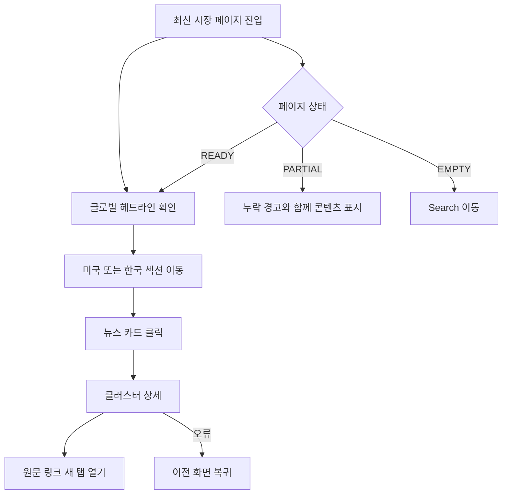
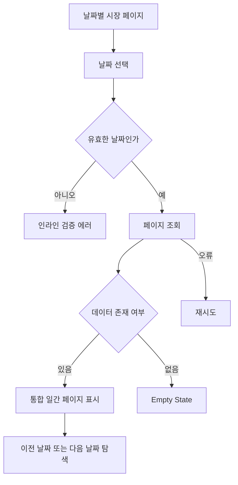
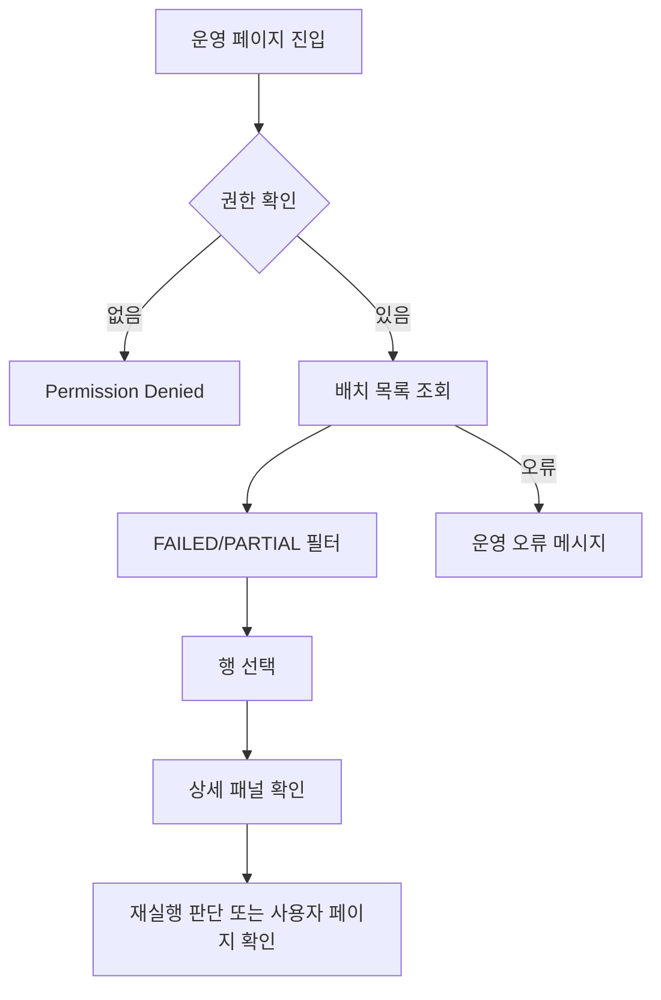

# 미국/한국 주식 시장 일간 뉴스 요약 페이지 와이어프레임

- 작성 목적: PRD 문서와 UI 요구사항 명세서 기반 와이어프레임
- 범위: PC(1920px)

## 공통 사항

- 로그인 없는 개인용 서비스이므로 일반 사용자 화면에는 권한 분기 대신 운영 화면 접근 제한만 고려한다.
- 일 배치는 하루 1회 실행되며, 미국/한국 시장 전체 결과를 한 번에 생성한다.
- 최신 페이지와 날짜별 페이지는 미국/한국 시장 결과를 하나의 페이지 안에 함께 노출한다.
- 기본 레이아웃은 `Global Header / Side Navigation / Content / Footer` 구조를 사용하되, 최신 시장 페이지에서는 Side Navigation을 보조 탐색으로 최소화한다.
- 콘텐츠 영역은 `max-width 1440px` 기준, 12-column grid를 사용한다.
- 프로젝트 UI는 최대한 Shadcn 기반 컴포넌트로 구현한다.
- 공통 컴포넌트: 버튼, 입력, 배지, 카드, 테이블, 탭, 시트/패널, 모달, 토스트, 스켈레톤, 페이지네이션
- 상태 UX 기본 패턴: `Loading / Empty / Partial / Error / Permission Denied`
- 기준일(`business_date`)과 생성 시각(`generated_at`)은 모든 페이지 헤더에서 분리 표기한다.
- 뉴스 정보의 기본 단위는 개별 기사 목록이 아니라 뉴스 클러스터 카드다.
- 통합 페이지 상단에는 글로벌 한줄 요약을 두고, 본문은 미국 섹션과 한국 섹션으로 나눈다.

## 1. 전체 레이아웃 시스템

### 1.1 글로벌 레이아웃

```text
+----------------------------------------------------------------------------------+
| Global Header: Service Name | Date Quick Nav | Search | Ops                      |
+----------------------+-----------------------------------------------------------+
| Side Navigation      | Page Header                                              |
| - 최신 시장 페이지   | Title / business_date / generated_at / status badge      |
| - 날짜별 시장 페이지 |-----------------------------------------------------------|
| - Search             | Main Content Grid                                        |
| - 배치 상태(운영)    | Footer                                                   |
+----------------------+-----------------------------------------------------------+
```

### 1.2 Grid / Spacing

- 전체 콘텐츠: 12컬럼
- 페이지 헤더: 12컬럼 전체
- 글로벌 헤드라인 배너: 12컬럼 전체
- 시장 섹션 헤더: 12컬럼 전체
- 대표 지수 카드: 시장별 3~4열
- 핵심 뉴스 카드: 시장별 2열
- 해설 섹션: 시장별 3열 또는 2:1:1 비율
- 원문 링크 / 메타 정보: 8:4 또는 9:3 분할

### 1.3 공통 상태 UX

- Loading: 글로벌 헤드라인 1개, 미국 지수 카드 3개, 한국 지수 카드 2개, 뉴스 카드 4개, 링크 리스트 5개 스켈레톤
- Empty: 조회 조건은 유지하고, “해당 날짜의 데이터가 아직 준비되지 않았습니다.” 메시지와 이전/다음 날짜 이동 제공
- Partial: 누락 영역 상단에 경고 배너 표시. 예: `미국 시장 데이터 일부가 누락되었습니다.`
- Error: 재시도 버튼, 마지막 성공 페이지 링크, 간단한 오류 메시지 표시
- Permission Denied: 운영 페이지 접근 시 권한 없음 화면으로 분리

## 2. 네비게이션

### 2.1 메뉴 구조 표

| 메뉴명             | 연결 라우트                                               | PC 위치                        | 노출 조건   |
| ------------------ | --------------------------------------------------------- | ------------------------------ | ----------- |
| 최신 시장 페이지   | `/`                                                       | Global Header, Side Navigation | 항상        |
| 날짜별 시장 페이지 | `/daily?date=YYYY-MM-DD`                                  | Date Picker, Prev/Next         | 항상        |
| 뉴스 클러스터 상세 | `/daily/:market/:date/clusters/:clusterId` 또는 우측 패널 | 뉴스 카드 CTA                  | 항상        |
| Search 페이지      | `/search`                                                 | Header 버튼, Side Navigation   | 항상        |
| 배치 상태 페이지   | `/ops/batches`                                            | Header Ops, Side Navigation    | 운영자 전용 |

### 2.2 탐색 원칙

- 1차 탐색: 날짜 전환(`최신/특정 날짜/이전/다음`)
- 2차 탐색: 페이지 내 미국/한국 섹션 간 이동
- 3차 탐색: 이슈 상세 진입(`뉴스 카드 상세 보기`)
- 보조 탐색: Search에서 날짜 기반 재진입

## 3. 화면별 와이어프레임

## [Screen] 최신 시장 페이지 (Route: `/`)

- 목적(Goal): 사용자가 가장 최근 생성된 일간 배치 결과에서 미국과 한국 시장 요약을 한 페이지에서 10~20초 안에 파악한다.
- 주요 사용자 시나리오
- 최신 시장을 열고 미국/한국 두 시장의 핵심 분위기를 비교한다.
- 각 시장 섹션에서 대표 지수와 핵심 뉴스 이슈를 빠르게 훑는다.
- 특정 뉴스 클러스터를 열어 관련 기사와 원문 링크를 확인한다.
- Search 또는 날짜 탐색으로 과거 페이지로 이동한다.
- 필수 데이터: 최신 통합 일간 페이지 스냅샷, `business_date`, `generated_at`, `status`, `global_headline`, `us_section`, `kr_section`, `metadata_json`
- 핵심 KPI: 첫 화면 핵심 정보 파악 속도, 뉴스 카드 상세 진입률

### 3.1 PC Wireframe

```text
+--------------------------------------------------------------------------------------------------+
| Market Daily Brief                                          [Search] [Ops]                       |
+----------------------+-------------------------------------------------------------------+
| SideNav              | 글로벌 시장 일간 요약                                             |
| - 최신 시장          | 기준일: 2026-03-17 | 생성시각: 2026-03-18 06:12 | 상태: READY     |
| - 날짜별 조회        |-------------------------------------------------------------------|
| - Search             | [Global Headline Banner]                                         |
| - 배치 상태          | 기술주 강세와 외국인 매수세 회복으로 미·한 증시 모두 강세        |
|                      |                                                                   |
|                      | [Quick Jump] [미국 시장으로] [한국 시장으로]                      |
|                      |-------------------------------------------------------------------|
|                      | [US Market Section]                                               |
|                      | 미국 증시 일간 요약                                                |
|                      | [NASDAQ ▲] [S&P 500 ▲] [DOW ▼] [보조 지표 옵션]                   |
|                      | close / change / percent / high / low                             |
|                      |                                                                   |
|                      | [US 핵심 뉴스]                                                    |
|                      | +--------------------------------+  +---------------------------+ |
|                      | | US News Cluster Card 01        |  | US News Cluster Card 02   | |
|                      | | 대표 제목                      |  | 대표 제목                 | |
|                      | | 요약 2~3줄                     |  | 요약 2~3줄                | |
|                      | | 태그 3개 / 관련 기사 6건       |  | 태그 / 관련 기사 4건      | |
|                      | | [원문 보기] [상세 보기]        |  | [원문 보기] [상세 보기]   | |
|                      | +--------------------------------+  +---------------------------+ |
|                      |                                                                   |
|                      | [미국 시장 해설]                                                  |
|                      | [상승/하락 배경] [주요 테마] [다음 관전 포인트]                  |
|                      |-------------------------------------------------------------------|
|                      | [KR Market Section]                                               |
|                      | 한국 증시 일간 요약                                                |
|                      | [KOSPI ▲] [KOSDAQ ▲] [보조 지표 옵션]                             |
|                      | close / change / percent / high / low                             |
|                      |                                                                   |
|                      | [KR 핵심 뉴스]                                                    |
|                      | +--------------------------------+  +---------------------------+ |
|                      | | KR News Cluster Card 01        |  | KR News Cluster Card 02   | |
|                      | | 대표 제목                      |  | 대표 제목                 | |
|                      | | 요약 2~3줄                     |  | 요약 2~3줄                | |
|                      | | 태그 3개 / 관련 기사 5건       |  | 태그 / 관련 기사 3건      | |
|                      | | [원문 보기] [상세 보기]        |  | [원문 보기] [상세 보기]   | |
|                      | +--------------------------------+  +---------------------------+ |
|                      |                                                                   |
|                      | [한국 시장 해설]                                                  |
|                      | [상승/하락 배경] [주요 테마] [다음 관전 포인트]                  |
|                      |-------------------------------------------------------------------|
|                      | [원문 기사 링크 리스트 - 시장 필터]            [메타 정보 카드]    |
|                      | 기사 제목 / 언론사 / 발행시각 / 시장 / 링크     수집/정제/업데이트 |
+----------------------+-------------------------------------------------------------------+
```

### 3.2 섹션 구성

- Summary
- 페이지 제목, 기준일, 생성 시각, 상태 배지, 글로벌 한줄 요약
- Filter / Context
- 빠른 날짜 이동, Search 이동, 미국/한국 섹션 점프
- Content
- 글로벌 헤드라인 배너, 미국 섹션, 한국 섹션, 통합 원문 기사 링크, 메타 정보

### 3.3 컴포넌트 목록

- 재사용
- `MarketSectionNav`
- `HeadlineBanner`
- `IndexCard`
- `NewsClusterCard`
- `AnalysisSection`
- `ArticleListItem`
- `StatusBadge`
- `MetaInfoCard`
- 페이지 전용
- `CombinedDailyPageHeader`
- `QuickDateNav`

### 3.4 인터랙션

- 미국/한국 섹션 앵커 클릭: 해당 섹션으로 스크롤 이동
- 뉴스 카드 클릭: 상세 패널 오픈 또는 상세 페이지 이동
- `원문 보기`: 새 탭으로 대표 기사 링크 열기
- `상세 보기`: 클러스터 상세 진입
- Search 버튼: `/search` 이동
- 키보드 탐색 순서: 날짜 탐색 → 미국 섹션 → 한국 섹션 → 원문 링크

### 3.5 상태 UX

- Loading
- 글로벌 헤드라인 스켈레톤 1개
- 미국 지수 카드 스켈레톤 3개
- 한국 지수 카드 스켈레톤 2개
- 뉴스 카드 스켈레톤 4개
- 링크 리스트 스켈레톤 5개
- Empty
- 최신 페이지가 아직 없을 경우 `가장 최근 생성된 시장 페이지가 없습니다.`와 Search 버튼 노출
- Partial
- 상단 경고 배너: `일부 데이터가 누락되었지만 사용 가능한 정보부터 제공합니다.`
- 특정 시장 데이터 누락 시 해당 시장 섹션 상단에 `미국 시장 데이터 일부 누락` 또는 `한국 시장 데이터 일부 누락` 배지 노출
- AI 요약 누락 시 뉴스 카드 요약 영역에 `요약 미생성` 텍스트와 원문 링크 우선 노출
- Error
- `페이지를 불러오는 중 문제가 발생했습니다.`와 재시도 버튼, 마지막 성공 날짜 링크 제공

### 3.6 행동/전환 설계

- Primary CTA: `상세 보기`
- Secondary CTA: `원문 보기`, `Search`
- 뒤로가기/취소 규칙: 상세 패널이면 `Esc` 또는 닫기 버튼으로 복귀, 상세 페이지면 브라우저 뒤로가기 시 같은 스크롤 위치 복원

### 3.7 접근성/반응형 주의사항

- 상태 배지는 색상 외 텍스트로 상태 전달
- 지수 상승/하락은 아이콘과 텍스트 동시 제공
- 카드 전체 포커스 가능 처리
- 미국/한국 섹션 제목은 명확한 heading hierarchy 사용
- 긴 링크 리스트는 키보드 포커스 이동 시 현재 행 강조

## [Screen] 날짜별 시장 페이지 (Route: `/daily?date=YYYY-MM-DD`)

- 목적(Goal): 사용자가 특정 날짜의 미국/한국 통합 시장 요약 페이지를 직접 조회한다.
- 주요 사용자 시나리오
- 날짜 선택기로 원하는 날짜를 조회한다.
- 이전/다음 날짜 버튼으로 연속된 날짜를 탐색한다.
- 없는 날짜인 경우 Empty State를 확인하고 인접 날짜로 이동한다.
- 필수 데이터: `business_date`, 날짜 선택 상태, 통합 일간 페이지 스냅샷
- 핵심 KPI: 날짜 조회 성공률, 인접 날짜 탐색률

### 3.1 PC Wireframe

```text
+--------------------------------------------------------------------------------------------------+
| Header                                                                                           |
+----------------------+-------------------------------------------------------------------+
| SideNav              | 날짜별 시장 페이지                                               |
|                      | [Date Picker: 2026-03-17] [조회] [이전 날짜] [다음 날짜]          |
|                      | 기준일: 2026-03-17 | 생성시각: 2026-03-18 06:12 | 상태: PARTIAL   |
|                      |-------------------------------------------------------------------|
|                      | [조건 요약 배너]                                                  |
|                      | 선택한 날짜의 미국/한국 통합 시장 페이지를 표시합니다.            |
|                      |-------------------------------------------------------------------|
|                      | [Latest Screen과 동일한 본문 구조]                                |
|                      | Global Headline / US Section / KR Section / Articles              |
+----------------------+-------------------------------------------------------------------+
```

### 3.2 컴포넌트 목록

- 재사용
- `DatePicker`
- `PrevNextDateNav`
- `HeadlineBanner`
- `IndexCard`
- `NewsClusterCard`
- 페이지 전용
- `DateContextBanner`

### 3.3 인터랙션

- 날짜 선택 후 `조회` 버튼 클릭 시 해당 날짜 페이지 조회
- 가정: PC에서는 자동 조회보다 명시적 `조회` 버튼이 오류 인지에 유리하다
- 이전/다음 날짜 버튼은 데이터 존재 여부와 무관하게 날짜 이동 가능
- 데이터 없는 날짜 도달 시 Empty State 렌더링

### 3.4 상태 UX

- Loading: 현재 선택 날짜를 헤더에 유지한 채 본문만 스켈레톤 처리
- Empty
- 문구: `해당 날짜의 페이지가 아직 생성되지 않았습니다.`
- 보조 문구: `배치가 실패했거나 데이터가 부족할 수 있습니다.`
- CTA: `이전 날짜 보기`, `최신 페이지로 이동`, `Search로 이동`
- Partial: 일부 시장 섹션 또는 일부 카드에 `데이터 누락` 배지 노출
- Error: 날짜 입력 유지, 재시도 버튼 제공

### 3.5 행동/전환 설계

- Primary CTA: `조회`
- Secondary CTA: `이전 날짜`, `다음 날짜`
- 폼 검증
- 미래 날짜 선택 시 `아직 생성될 수 없는 날짜입니다.` 메시지
- 잘못된 날짜 형식은 인라인 에러 처리
- 뒤로가기/취소 규칙: 브라우저 뒤로가기는 직전 날짜 조합으로 이동

### 3.6 접근성/반응형 주의사항

- Date Picker는 키보드 조작 가능해야 함
- 날짜 변경 시 페이지 제목과 상태 변화를 스크린리더에 알림
- 인접 날짜 이동 버튼은 `이전 영업일`, `다음 영업일` 의미를 혼동하지 않도록 툴팁 제공

## [Screen] 뉴스 클러스터 상세 패널/페이지 (Route: `/daily/:market/:date/clusters/:clusterId`)

- 목적(Goal): 특정 핵심 뉴스 이슈의 상세 요약과 관련 기사 목록을 확인한다.
- 주요 사용자 시나리오
- 최신/날짜별 페이지에서 카드 클릭 후 상세를 연다.
- 관련 기사 여러 건을 비교하고 대표 링크 또는 원문으로 이동한다.
- 태그와 상세 요약을 통해 이슈의 맥락을 파악한다.
- 필수 데이터: `cluster_id`, `market_type`, 대표 제목, 상세 요약, 태그, 관련 기사 리스트, 대표 링크
- 핵심 KPI: 상세 열람 후 원문 클릭률

### 3.1 PC Wireframe

```text
+---------------------------------------------------------------------------------------------+
| Breadcrumb: 미국 > 2026-03-17 > 뉴스 클러스터 상세                                          |
+---------------------------------------------------------------------------------------------+
| [Cluster Title] 금리 인하 기대와 반도체 실적 개선 기대가 기술주를 견인                      |
| [태그] 금리 / 기술주 / 반도체 / 나스닥                                                       |
|---------------------------------------------------------------------------------------------|
| [상세 요약]                                                                                 |
| 10~15줄 설명                                                                                |
|---------------------------------------------------------------------------------------------|
| [대표 링크 카드] 대표 기사 제목 / 언론사 / 발행시각 / [원문 보기] [네이버 보기]             |
|---------------------------------------------------------------------------------------------|
| [관련 기사 리스트]                                                                          |
| 1. 기사 제목 | 언론사 | 발행시각 | [원문] [네이버]                                         |
| 2. 기사 제목 | 언론사 | 발행시각 | [원문] [네이버]                                         |
| 3. 기사 제목 | 언론사 | 발행시각 | [원문] [네이버]                                         |
|---------------------------------------------------------------------------------------------|
| [하단 액션] [이전 화면으로] [같은 날짜 페이지로 이동]                                        |
+---------------------------------------------------------------------------------------------+
```

### 3.2 컴포넌트 목록

- 재사용
- `TagList`
- `ArticleListItem`
- `PrimaryLinkCard`
- 페이지 전용
- `ClusterDetailSummary`

### 3.3 인터랙션

- 카드 상세는 우측 시트 패널 또는 독립 페이지로 구현 가능
- 가정: 초기 버전은 URL 접근 가능한 독립 페이지가 공유성과 복귀 안정성 측면에서 유리하다
- 대표 링크 / 네이버 링크는 새 탭 이동
- 관련 기사 정렬: 대표 기사 우선, 이후 발행시각 내림차순

### 3.4 상태 UX

- Loading: 제목, 태그, 리스트 영역 분리 스켈레톤
- Empty: 클러스터 삭제 또는 데이터 손상 시 `해당 이슈 정보를 찾을 수 없습니다.`
- Partial: 일부 기사 링크 누락 시 링크 버튼 비활성 + 툴팁
- Error: 상세 로딩 실패 시 이전 화면 복귀 CTA 제공

### 3.5 행동/전환 설계

- Primary CTA: `원문 보기`
- Secondary CTA: `같은 날짜 페이지로 이동`, `이전 화면으로`
- 뒤로가기/취소 규칙: 브라우저 뒤로가기는 진입 페이지와 스크롤 위치를 복구

### 3.6 접근성/반응형 주의사항

- 외부 링크는 새 탭 열림 안내 문구 또는 아이콘 포함
- 기사 리스트는 테이블이 아닌 리스트여도 충분한 heading/label 제공
- 상세 패널 사용 시 포커스 트랩 적용

## [Screen] Search 페이지 (Route: `/search`)

- 목적(Goal): 과거 날짜의 통합 시장 페이지를 날짜와 조건 기준으로 빠르게 탐색한다.
- 주요 사용자 시나리오
- 최근 7일 또는 30일 범위로 날짜 목록을 훑는다.
- 특정 날짜의 미국/한국 요약을 보고 진입 여부를 결정한다.
- READY/PARTIAL 상태를 미리 확인한다.
- 필수 데이터: 날짜 목록, 통합 요약 미리보기, 상태, 생성 시각
- 핵심 KPI: Search에서 날짜 페이지 진입률

### 3.1 PC Wireframe

```text
+--------------------------------------------------------------------------------------------------+
| Header: Search                                                                                   |
+----------------------+-------------------------------------------------------------------+
| SideNav              | Search                                                             |
|                      | [기간: 최근 7일/30일] [상태 필터] [날짜 직접 입력] [검색 버튼]     |
|                      |-------------------------------------------------------------------|
|                      | [Search Table or Card List]                                       |
|                      | 날짜         글로벌 한줄 요약                       상태   생성시각 |
|                      | 2026-03-17   기술주 강세와 외국인 매수세 회복...    READY  06:12   |
|                      | 2026-03-16   연준 발언 경계와 환율 부담으로 혼조... PARTIAL 06:09  |
|                      | 2026-03-15   주말 배치 없음 또는 데이터 없음         EMPTY  -       |
|                      |-------------------------------------------------------------------|
|                      | [Pagination]                                                      |
+----------------------+-------------------------------------------------------------------+
```

### 3.2 컴포넌트 목록

- 재사용
- `RangeFilter`
- `StatusBadge`
- `SearchListItem`
- 페이지 전용
- `SearchSummaryBar`

### 3.3 인터랙션

- 행 클릭: 해당 날짜 통합 페이지 이동
- 상태 배지 hover: PARTIAL 사유 툴팁 노출
- 기간 필터 변경: 목록 즉시 재조회
- 날짜 직접 입력 후 검색: 특정 날짜 결과 우선 노출

### 3.4 상태 UX

- Loading: 목록 8행 스켈레톤
- Empty: `조건에 맞는 검색 결과가 없습니다.`
- Partial: 목록 행 수준에서 경고 아이콘과 사유 요약
- Error: 필터는 유지하고 목록만 오류 상태 표시

### 3.5 행동/전환 설계

- Primary CTA: `날짜 페이지 열기`
- Secondary CTA: `최신 페이지로 이동`
- 뒤로가기/취소 규칙: 상세 페이지에서 돌아오면 기존 필터/스크롤 위치 유지

### 3.6 접근성/반응형 주의사항

- 표 사용 시 열 헤더와 정렬 상태 제공
- 카드형 대체 레이아웃에서도 날짜와 상태가 첫 줄에 노출되어야 함

## [Screen] 배치 상태 페이지(운영용) (Route: `/ops/batches`)

- 목적(Goal): 운영자가 배치 성공/실패 여부와 품질 상태를 빠르게 파악한다.
- 주요 사용자 시나리오
- 최근 배치 이력을 확인한다.
- 실패 배치의 에러 메시지와 영향 범위를 확인한다.
- PARTIAL 또는 FAILED 건을 찾아 재실행 판단을 한다.
- 필수 데이터: `job_name`, `business_date`, `status`, `started_at`, `ended_at`, 수집/정제/클러스터 수, `error_message`
- 핵심 KPI: 실패 원인 파악 시간, 운영 재확인 시간

### 3.1 PC Wireframe

```text
+---------------------------------------------------------------------------------------------------+
| Header: Batch Operations                                                                          |
+----------------------+--------------------------------------------------------------------+
| SideNav              | 배치 상태 페이지                                                    |
|                      | [상태 필터] [기간 필터]                                             |
|                      |--------------------------------------------------------------------|
|                      | job_name | business_date | status | start | end | counts          |
|                      | daily    | 2026-03-17    | SUCCESS| 05:59 | 06:18 | 77/32/9       |
|                      | daily    | 2026-03-16    | PARTIAL| 06:00 | 06:11 | 70/28/8       |
|                      | daily    | 2026-03-15    | FAILED | 06:02 | 06:04 | -             |
|                      |--------------------------------------------------------------------|
|                      | [Selected Row Detail]                                                |
|                      | 에러 메시지 / fallback 발생 여부 / 생성 page version / 로그 요약     |
|                      | [재실행 버튼 - 선택]                                                |
+----------------------+--------------------------------------------------------------------+
```

### 3.2 컴포넌트 목록

- 재사용
- `StatusBadge`
- `DataTable`
- `DetailDrawer`
- 페이지 전용
- `BatchQualityCounts`
- `BatchErrorPanel`

### 3.3 인터랙션

- 행 클릭: 하단 상세 또는 우측 드로어 오픈
- 상태 필터 클릭: SUCCESS / PARTIAL / FAILED
- 재실행 버튼: 후속 확장 항목으로 비활성 또는 조건부 노출

### 3.4 상태 UX

- Loading: 테이블 헤더 유지, 본문 스켈레톤 10행
- Empty: `선택한 조건의 배치 이력이 없습니다.`
- Partial: 품질 수치 옆 경고 강조
- Error: 운영 API 오류는 사용자용 페이지와 분리된 메시지로 상세하게 노출 가능
- Permission Denied: `운영 페이지 접근 권한이 없습니다.`

### 3.5 행동/전환 설계

- Primary CTA: `상세 확인`
- Secondary CTA: `재실행`(선택), `최신 페이지 확인`
- 뒤로가기/취소 규칙: 상세 드로어 닫아도 필터와 정렬 상태 유지

### 3.6 접근성/반응형 주의사항

- 상태 색상 대비 준수
- 운영 메시지는 일반 사용자 페이지에 노출되지 않도록 라우트 단위 분리
- 테이블 키보드 탐색 및 행 선택 상태 제공

## 4. 사용자 플로우 와이어

### 4.1 플로우: 최신 시장 확인 후 이슈 상세 진입

- 단계별 화면 전환
- 최신 시장 페이지 진입
- 글로벌 헤드라인 확인
- 미국/한국 섹션 중 관심 시장으로 이동
- 뉴스 카드 클릭
- 클러스터 상세 확인
- 원문 링크 새 탭 열기
- 실패/예외 분기
- 최신 페이지 없음: Empty State에서 Search 이동
- 일부 데이터 누락: Partial 배너와 시장별 누락 배지 표시
- 상세 로딩 실패: 이전 화면 복귀



### 4.2 플로우: 특정 날짜 시장 복기

- 단계별 화면 전환
- 날짜별 시장 페이지 진입
- 날짜 입력
- 결과 페이지 확인
- 이전/다음 날짜 반복 탐색
- 실패/예외 분기
- 날짜 데이터 없음: Empty State
- 미래 날짜 선택: 검증 에러
- API 오류: 재시도



### 4.3 플로우: 운영자가 배치 실패 확인

- 단계별 화면 전환
- 배치 상태 페이지 진입
- 상태 필터를 FAILED 또는 PARTIAL로 변경
- 특정 배치 행 선택
- 에러 메시지와 품질 수치 확인
- 필요 시 재실행 또는 사용자 페이지 확인
- 실패/예외 분기
- 권한 없음: Permission Denied
- 로그 누락: 상세 패널에 `로그 정보 없음`



## 5. 전면 개편 옵션

### 5.1 안 A: 기존 정보 구조 유지 + UI만 개선

- 방향: 현재 PRD의 정보 우선순위를 그대로 유지하고 시각 계층과 상태 UX만 정교화
- 장점
- 구현 범위가 명확하고 빠르다.
- 백엔드 스냅샷 구조와 직접 매핑하기 쉽다.
- 초기 버전 리스크가 낮다.
- 단점
- 탐색 경험이 다소 보수적일 수 있다.
- 통합 페이지의 정보 밀도가 높아질 수 있다.
- 리스크
- 미국/한국 두 시장을 한 페이지에 넣으면서 첫 화면 길이가 길어질 수 있다.
- 추천 이유: 1차 출시 기준으로 가장 현실적이다.

### 5.2 안 B: 완전 재구성형 시장 브리핑 대시보드

- 방향: 상단에 글로벌 브리핑, 좌우 또는 상하 분할로 미국/한국 시장을 동시에 비교하는 대시보드형 구조
- 장점
- 두 시장 비교가 직관적이다.
- 고빈도 사용자의 반복 탐색 효율이 높다.
- 단점
- 초기 정보 밀도와 설계 복잡도가 높다.
- 반응형 전환 비용이 크다.
- 리스크
- 데이터 누락이나 Empty 상태에서 레이아웃 붕괴 가능성이 있다.
- 백엔드 응답 구조도 일부 맞춤 조정이 필요할 수 있다.
- 추천 이유: 운영이 안정화된 뒤 2차 개편안으로 적합하다.

## 6. 최종 체크리스트

- PRD와 UI 요구사항 문서의 모든 핵심 화면이 포함되어 있는가
- 최신 시장 페이지
- 날짜별 시장 페이지
- 뉴스 클러스터 상세
- Search 페이지
- 배치 상태 페이지
- 각 화면에 Loading / Empty / Partial / Error가 정의되어 있는가
- CTA와 화면 전환 규칙이 정의되어 있는가
- 날짜 선택, 링크 이동, 상세 진입, 뒤로가기 규칙이 정의되어 있는가
- 기준일과 생성 시각이 분리 표기되는가
- 뉴스 단위가 기사 목록이 아니라 이슈 카드 중심으로 유지되는가
- 일부 데이터 누락 시 숨기지 않고 노출하는가
