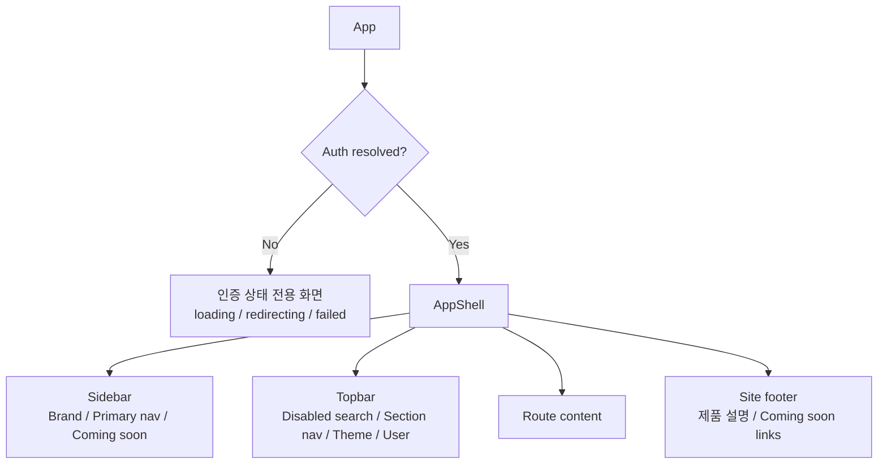
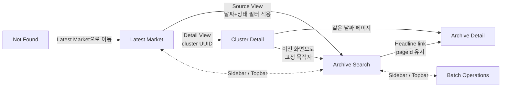

# IA 구조도

## 1. 전역 구조



인증이 해결되기 전에는 사이드바, 상단 바, 푸터를 포함한 보호 셸이 전혀 렌더링되지 않는다. 인증 완료 후 `/`는 `/market/latest`로 정규화된다.

## 2. 콘텐츠 계층

```text
Market Brief
├── Market
│   ├── Latest Market
│   │   ├── 당일 상태 / 비즈니스 날짜 / 생성 시각
│   │   ├── Global Market Insight
│   │   └── 시장 섹션 × N
│   │       ├── Analyst Narrative
│   │       ├── Index cards × N
│   │       └── News cluster cards × N
│   │           ├── Source View → Archive Search
│   │           └── Detail View → Cluster Detail
│   ├── Archive
│   │   ├── Archive Search
│   │   │   ├── Date range / Status filters
│   │   │   ├── Result table
│   │   │   └── Prev / Next pagination
│   │   └── Archive Market Detail
│   │       └── Latest Market과 동일한 시장 요약 구조
│   └── Cluster Detail
│       ├── Breadcrumb / tags
│       ├── AI analysis
│       ├── Related news timeline
│       ├── Representative article
│       └── Metrics / archive 이동
├── Operations
│   └── Batch Operations
│       ├── Manual Trigger
│       ├── KPI summary
│       ├── Filters
│       ├── Execution history
│       ├── Selected run detail
│       └── Result count / trigger error
└── System
    ├── Authentication states
    └── Route not found
```

## 3. 라우트 인벤토리

| 화면 | 제품 URL | 쿼리 | 기본 내비게이션 위치 | 데이터 소스 |
| --- | --- | --- | --- | --- |
| Latest Market | `/market/latest` | 없음 | Latest Market | 최신 daily page |
| Archive Search | `/market/archive/search` | `from`, `to`, `status`, `page` | Archive | archive list |
| Archive Market Detail | `/market/archive/:YYYY-MM-DD` | 선택 `pageId` | Archive | page ID 우선, 없으면 날짜 |
| Cluster Detail | `/market/cluster/:uuid` | 없음 | Latest Market | cluster detail |
| Batch Operations | `/ops/batches` | `from`, `to`, `status`, `page` | Batch Status / Ops Admin | jobs list + selected job detail |
| Not Found | 그 외 모든 경로 | 무시 | 없음 | 없음 |

라우트 제약:

- 아카이브 날짜는 `YYYY-MM-DD` 형식만 허용한다.
- 클러스터 ID는 소문자 16진수 UUID 형식만 허용한다.
- `pageId`와 `page`는 1 이상의 안전한 정수만 허용한다.
- 목록의 날짜가 역순으로 들어오면 `from`/`to`를 서로 바꿔 정규화한다.
- 허용되지 않은 상태값은 빈 값(All)으로 정규화한다.
- 목록 기본 날짜는 실행일 기준 최근 14일에서 오늘까지다.

## 4. 화면 이동 구조



중요한 현재 동작:

- 클러스터 상세의 “이전 화면으로”는 브라우저 history back이 아니라 항상 Archive Search로 이동한다.
- Source View는 snapshot의 날짜를 `from`과 `to`에 모두 넣고 snapshot 상태를 대문자 목록 필터 상태로 변환한다.
- Archive Search의 상세 이동은 행 전체가 아니라 헤드라인 텍스트 링크에만 적용된다.
- Batch Operations는 목록에서 첫 `FAILED` 작업을 우선 선택하고, 실패가 없으면 첫 행을 기본 선택한다.

## 5. 전역 내비게이션

현재 동일한 주요 영역이 두 번 노출된다.

| 위치 | 항목 | 활성화 규칙 |
| --- | --- | --- |
| Sidebar | Latest Market | latest 또는 cluster detail |
| Sidebar | Archive | `/market/archive` 시작 |
| Sidebar | Batch Status | `/ops/batches` 시작 |
| Topbar | Latest Market | latest만 정확히 일치 |
| Topbar | Archive | `/market/archive` 시작 |
| Topbar | Ops Admin | `/ops/batches` 시작 |

Cluster Detail에서는 Sidebar의 Latest Market은 활성화되지만 Topbar의 Latest Market은 활성화되지 않는다. v2에서는 중복 내비게이션 제거뿐 아니라 이 활성화 규칙 불일치도 정리해야 한다.

## 6. 사용자 역할과 권한 표현

현재 화면에는 `Admin.Ops` 한 역할만 고정 표시되며, 역할별 메뉴/권한 분기는 프론트 코드에 없다. 인증 토큰 획득 여부만 보호 셸 진입을 결정한다. v2 IA에서 역할별 경험을 추가하려면 별도 권한 모델과 메뉴 노출 계약이 필요하다.

