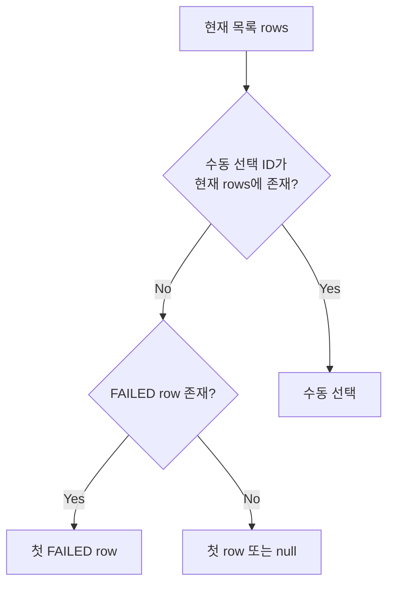

# 현재 UI 와이어프레임

와이어프레임은 코드의 실제 DOM 순서와 반응형 CSS를 기준으로 단순화했다. `[ ]`는 카드/영역, `( )`는 액션, `—`는 구분선이다.

## 1. 공통 App Shell

### 데스크톱: 981px 이상

```text
┌────────────── 272px fixed sidebar ──────────────┬──────────────────────── shell main ────────────────────────┐
│ Market Brief                                    │ [disabled global search]  Latest  Archive  Ops  ◐  Admin   │
│ Financial Intelligence Console                  ├────────────────────────────────────────────────────────────┤
│                                                 │                                                            │
│ [■] Latest Market                               │  route content (max 1440px, centered)                      │
│ [□] Archive                                     │                                                            │
│ [□] Batch Status                                │                                                            │
│                                                 │                                                            │
│                                                 │                                                            │
│ —————————————————————————————————————————————   │                                                            │
│ ? Support · Coming soon                         │                                                            │
│ ▤ Documentation · Coming soon                   ├────────────────────────────────────────────────────────────┤
│                                                 │ [Market Daily Brief] [3 × Coming soon footer items]         │
└─────────────────────────────────────────────────┴────────────────────────────────────────────────────────────┘
```

- 사이드바는 viewport에 고정되고 본문만 길어진다.
- 상단 바는 sticky다.
- 검색 입력은 화면별 placeholder만 바뀌며 항상 disabled/readOnly다.
- 테마 토글은 현재 시스템 테마를 초기값으로 사용하고 세션 저장은 하지 않는다.

### 태블릿/모바일: 980px 이하의 실제 순서

```text
┌──────────────────────────────────────────┐
│ Brand                                    │
│ [Latest] [Archive] [Batch]               │  ← 실제 CSS는 세로 grid
│ Support / Documentation                  │
├──────────────────────────────────────────┤
│ [disabled search]                        │
│ Latest  Archive  Ops                     │
│ ◐                         Admin.Ops       │
├──────────────────────────────────────────┤
│ route content                            │
├──────────────────────────────────────────┤
│ footer                                   │
└──────────────────────────────────────────┘
```

사이드바가 축약 메뉴로 바뀌지 않고 `position: static; width: 100%`가 되기 때문에 브랜드·주요 메뉴·지원 메뉴 전체가 본문 앞에 놓인다.

## 2. Latest / Archive Market

두 화면은 제목의 “글로벌”/“아카이브” 표현과 조회 API만 다르고 구조는 동일하다.

### 데스크톱

```text
┌────────────────────────────────────────────────────────────────────────────┐
│ [Market Daily Brief] [STATUS]                │ [icon] Global Market Insight │
│ YYYY-MM-DD 글로벌/아카이브 시장 요약         │ Headline                     │
│ description                                 │                              │
│ Business Date · Generated                   │                              │
└────────────────────────────────────────────────────────────────────────────┘

US Market — summary title ────────────────────────────────────────────────────
┌────────────────────────────────────────────────────────────────────────────┐
│ Analyst Narrative                              [Index Set] [News Clusters] │
└────────────────────────────────────────────────────────────────────────────┘
┌──────── Index 1 ────────┐ ┌──────── Index 2 ────────┐ ┌──── Index 3 ──────┐
│ value / delta / H / L   │ │ value / delta / H / L   │ │ value / delta     │
└─────────────────────────┘ └─────────────────────────┘ └────────────────────┘
┌──────────── Cluster 1 ─────────────────┐ ┌────────── Cluster 2 ───────────┐
│ title / count / summary / tags         │ │ title / count / summary / tags │
│ (Source View) (Detail View)            │ │ (Source View) (Detail View)    │
└────────────────────────────────────────┘ └────────────────────────────────┘

KR Market — 위 시장 섹션 반복
```

### 모바일

```text
[Hero copy]
[Global Market Insight]

US Market
[Narrative + metrics stacked]
[Index 1]
[Index 2]
[Index 3]
[Cluster 1]
[Cluster 2]

KR Market
[동일 반복]
```

720px 이하에서 index, cluster, summary가 모두 1열이 된다. 데이터 양이 많아 현재 Mock 기준 full-page 높이가 약 5,408px이다.

### 화면 전체를 대체하는 상태

```text
┌────────────────────────────────────────┐
│                                        │
│            State title                 │
│            description                 │
│                                        │
└────────────────────────────────────────┘
```

- Loading Market Data
- Market Data Unavailable
- No Market Data (방어 분기, 현재 API 흐름으로 도달하기 어려움)

성공 응답이지만 `markets: []`인 경우에는 hero만 보이고 시장 섹션이 없는 상태가 된다.

## 3. Archive Search

### 데스크톱

```text
Archive Search
과거 시장 기록 탐색
description

┌──────────────────────────────────────────────────────────────────────────┐
│ From [date]     To [date]     Status [select]       (Search)             │
└──────────────────────────────────────────────────────────────────────────┘

┌──────────────────────────────────────────────────────────────────────────┐
│ DATE        GLOBAL HEADLINE PREVIEW         STATUS       GENERATION TIME │
│ ● date      linked headline                 READY        hh:mm:ss         │
│ ● date      linked headline                 PARTIAL      hh:mm:ss         │
│ ● date      linked headline                 FAILED       hh:mm:ss         │
└──────────────────────────────────────────────────────────────────────────┘
Showing n of N                         (Prev)       Page x / y       (Next)
```

상태 셀렉트는 Radix popover이며 `All Status`, `READY`, `PARTIAL`, `FAILED`를 제공한다. Search 제출 시 page를 1로 초기화한다.

### 빈 목록

```text
┌──────────────────────────────────────────────────────────────────────────┐
│ header row                                                               │
│ 조회 조건에 맞는 아카이브 결과가 없습니다.                              │
└──────────────────────────────────────────────────────────────────────────┘
Showing 0 of 0                      disabled Prev / Page 1 of 1 / disabled Next
```

### 모바일의 실제 문제

```text
390px viewport
┌──────────────────────────────────────┐
│ intro                                │──────────────┐
│ [filters, 1 column]                  │              │  document width ≈ 862px
│ [760px min-width result table ───────┼──────────────┤
└──────────────────────────────────────┘              │
                    horizontal overflow ──────────────┘
```

필터는 정상적으로 1열이 되지만 테이블은 `min-width: 760px`를 유지한다. [모바일 full-page](./screenshots/20-archive-search-mobile.png)와 [390px 실제 viewport](./screenshots/42-archive-search-mobile-viewport.png)를 함께 봐야 한다.

## 4. Cluster Detail

### 데스크톱

```text
Breadcrumb > Business date > 뉴스 클러스터 상세
Cluster title
[tags...]

┌──────────────────────────── main ──────────────────────┬──── aside ────────┐
│ [AI 심층 분석 리포트]                                 │ [Representative]  │
│ paragraph × N                                         │ visual / source   │
│                                                       │ title / summary   │
│ 관련 뉴스 타임라인 ─────────────────────────────────  │ (Original)        │
│ [source · time / title / Original / Mirror] × N       │ (Mirror)          │
│                                                       │                   │
│                                                       │ [Metric list]     │
└───────────────────────────────────────────────────────┴───────────────────┘

(이전 화면으로)                         (같은 날짜 페이지로 이동)
```

### 모바일

```text
[Breadcrumb / title / tags]
[AI report]
[Timeline cards × N]
[Representative article]
[Metrics]
(이전 화면으로)
(같은 날짜 페이지로 이동)
```

1180px 이하부터 main/aside가 1열이 되며 aside의 sticky도 해제된다. 외부 URL은 `http`/`https`만 버튼으로 렌더링한다. 유효 링크가 없고 기사/분석이 빈 sparse 상태에서는 제목, 빈 분석 패널, 대표 기사 fallback, 0건 metric만 남는다.

## 5. Batch Operations

### 데스크톱

```text
Operations
Batch Operations                                             (Manual Trigger)
description

┌──── Recent Success ────┐ ┌──── Avg Processing ────┐ ┌──── Sync Quality ──┐
│ KPI / supporting       │ │ KPI / supporting       │ │ KPI / supporting   │
└────────────────────────┘ └─────────────────────────┘ └────────────────────┘

┌──────────────────────── history table ─────────────────────┬─ detail ─────┐
│ Batch Execution History                    [US] [KR]        │ Selected Run │
│ Status / From / To / Apply Filters                         │ log box       │
│ MARKET DATE STATUS TIMELINE COUNTS (select)                 │ Job ID        │
│ row                                                        │ Page Version  │
│ row                                                        │ Date          │
│ row                                                        │ Duration      │
└────────────────────────────────────────────────────────────┴──────────────┘

Showing n of N batch jobs
[trigger failure message, 실패했을 때만]
```

### 선택 규칙



목록과 선택 상세는 독립 API 요청이다. 상세 패널만 로딩/오류가 될 수 있으며 그때 목록과 KPI는 유지된다.

### Manual Trigger 상태

```text
idle:     (Manual Trigger)
pending:  (Triggering...) disabled
error:    버튼은 idle 복귀 + 페이지 하단 오류 문구
success:  목록/상세 query invalidate, 별도 성공 toast 없음
```

### 모바일

KPI는 1열, history/detail은 1열이 되지만 history table의 `min-width: 760px` 때문에 Archive Search와 같은 문서 가로 오버플로우가 생긴다. [모바일 full-page](./screenshots/36-batch-mobile.png)와 [390px 실제 viewport](./screenshots/43-batch-mobile-viewport.png)를 참고한다.

## 6. Not Found

```text
공통 App Shell 유지

               [icon]
          Route not found
  정의되지 않은 경로입니다...
        (Latest Market으로 이동)
```

## 7. 인증 상태

인증 상태에서는 App Shell이 전혀 나타나지 않는다.

```text
full viewport

          로그인 상태를 확인하고 있습니다
                 잠시만 기다려 주세요.

          로그인 페이지로 이동 중입니다
      자동으로 이동하지 않으면 새로고침...

        로그인 상태를 확인할 수 없습니다
        잠시 후 다시 시도하거나 로그인...
```

