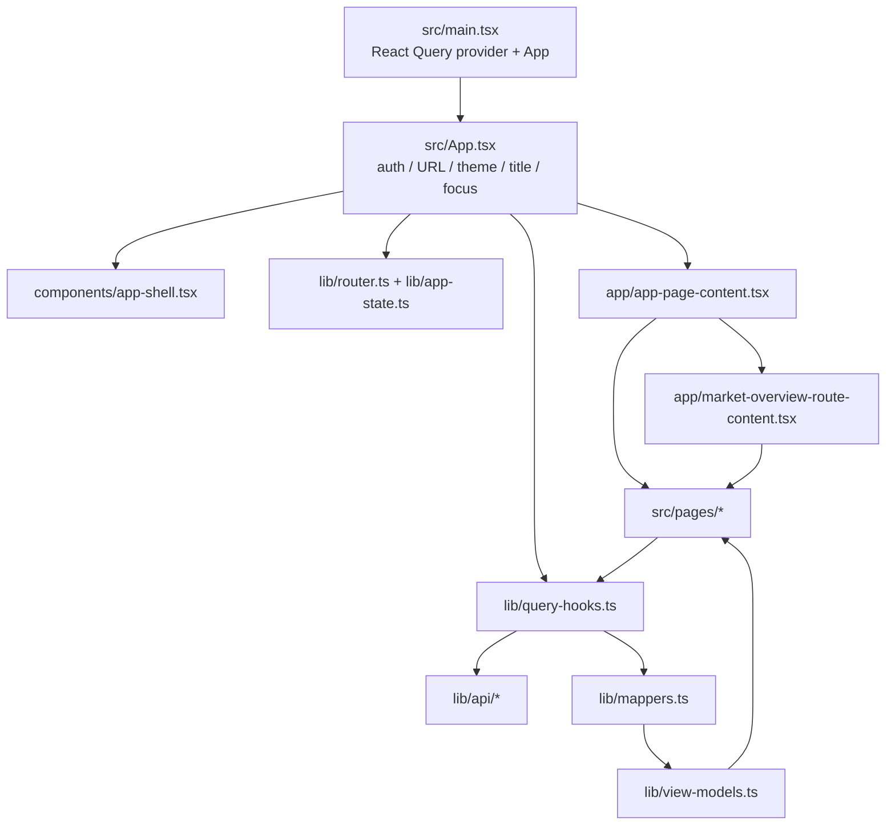
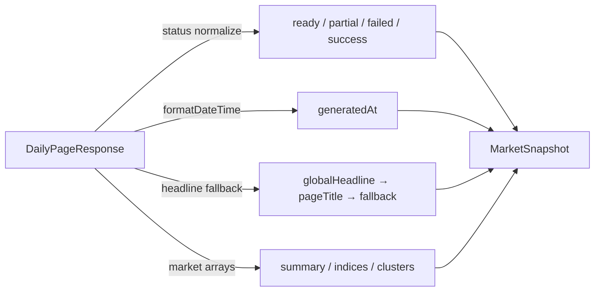
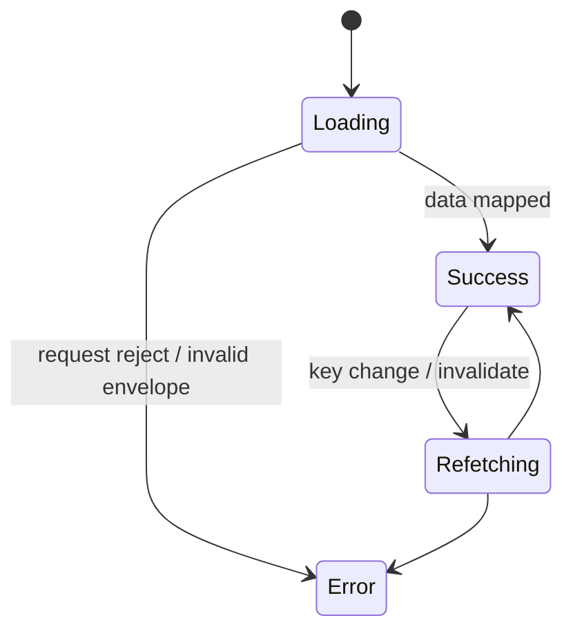

# 컴포넌트·데이터·스타일 계약

## 1. 애플리케이션 구조



라우터 프레임워크를 사용하지 않는다. 링크는 실제 `href`와 `onClick`을 함께 가지며, 보조키 클릭은 브라우저 기본 동작을 유지하고 일반 클릭은 History API와 `routechange` custom event를 사용한다.

## 2. 화면별 컴포넌트 트리

### App Shell

```text
App
└── AppShell
    ├── skip link
    ├── Sidebar
    │   ├── Brand
    │   ├── Primary nav
    │   └── Support links (static)
    ├── Topbar
    │   ├── Disabled search
    │   ├── Section nav
    │   ├── Theme toggle
    │   └── User chip
    ├── main.content
    │   └── AppPageContent
    └── Site footer
```

### Market Overview

```text
MarketOverviewRouteContent
├── PageMessage (loading/error/no data)
└── MarketOverviewPage
    ├── hero header + insight callout
    └── market section × N
        ├── market summary
        ├── IndexCard × N
        └── ClusterPreviewCard × N
```

### Archive Search

```text
ArchiveSearchPage
├── PageMessage (list loading/error)
└── ArchiveSearchContent
    ├── intro
    ├── ArchiveSearchFilters
    ├── ArchiveResultsTable
    └── ArchivePagination
```

### Cluster Detail

```text
ClusterDetailPage
├── PageMessage (loading/error/no data)
└── content
    ├── intro / breadcrumb / tags
    ├── detail main
    │   ├── analysis
    │   └── article timeline
    ├── detail aside
    │   ├── representative article
    │   └── metric list
    └── detail footer actions
```

### Batch Operations

```text
BatchOperationsPage
├── PageMessage (jobs list loading/error)
└── BatchOperationsContent
    ├── BatchOperationsSummary
    ├── ops grid
    │   ├── BatchOperationsHistoryTable
    │   │   └── BatchOperationsFilters
    │   └── BatchRunDetailPanel
    └── BatchOperationsFooter
```

## 3. API 인벤토리

모든 API는 `VITE_API_HOST`와 아래 path를 결합한다. GET/POST 응답은 `{ success?, data, meta? }` envelope가 필요하다.

| 목적 | Method | Path | Query / Body | 주요 UI |
| --- | --- | --- | --- | --- |
| auth token | POST | `/api/user/token` | credentials included | 전역 인증 |
| latest daily page | GET | `/stock/api/pages/daily/latest` | 없음 | Latest |
| daily page by date | GET | `/stock/api/pages/daily` | `businessDate` | Archive Detail |
| daily page by ID | GET | `/stock/api/pages/:pageId` | 없음 | Archive Detail |
| archive list | GET | `/stock/api/pages/archive` | `fromDate`, `toDate`, `status`, `page`, `size=4` | Archive Search |
| cluster detail | GET | `/stock/api/news/clusters/:clusterId` | 없음 | Cluster Detail |
| batch jobs | GET | `/stock/api/batch/jobs` | `fromDate`, `toDate`, `status`, `page`, `size=20` | Batch Operations |
| batch job detail | GET | `/stock/api/batch/jobs/:jobId` | 없음 | Batch detail panel |
| manual batch | POST | `/stock/api/batch/market-daily` | 현재 `{}` | Manual Trigger |

API 오류 표현:

- 401은 고정된 Bearer token 안내 메시지로 변환된다.
- FastAPI validation detail 배열은 `field: message` 문자열로 합친다.
- network error는 backend/CORS/API host 확인 문구로 변환된다.
- HTTP 2xx라도 envelope에 `data`가 없거나 `success === false`이면 오류다.

## 4. DTO → View Model 변환

### Daily Page → Market Snapshot



Index:

- 숫자 문자열을 표시용으로 포맷한다.
- `changeValue >= 0`이면 up, 아니면 down이다.
- high/low가 없으면 `-`로 표시한다.

Cluster card:

- summary가 없으면 representative article title, 그마저 없으면 fallback 문구다.
- tags가 빈 배열이면 태그 영역도 빈 채로 남는다.

### Archive List

- 상태 허용값: `READY`, `PARTIAL`, `FAILED`; 그 외 값은 `FAILED`.
- headline은 `headlineSummary` → `pageTitle` → fallback 순서다.
- total pages는 `max(1, ceil(totalCount / size))`.

### Cluster Detail

- 기사 ID는 `processedArticleId`가 없으면 cluster/index 기반 fallback.
- source가 없으면 `Unknown Source`.
- mirror URL이 없으면 origin URL을 mirror 값으로 다시 사용한다.
- 렌더링 단계에서 URL protocol이 `http:` 또는 `https:`가 아니면 액션 버튼을 숨긴다.
- `articleCount`가 유효한 음이 아닌 정수가 아니면 articles 길이를 사용한다.

### Batch

- 상태 허용값: `SUCCESS`, `PARTIAL`, `FAILED`; 그 외 값은 `FAILED`.
- count 표시는 `raw / processed / cluster`.
- duration은 초를 사람이 읽는 형식으로 바꾼다.
- list item 상세 fallback과 detail API 상세 fallback의 우선순위가 다르다.
- summary 성공률은 현재 결과 집합의 success / 전체 상태 합으로 계산한다.
- failed가 0이면 sync quality `Stable`, 하나 이상이면 `Attention`.

## 5. React Query 상태 모델



현재 화면은 `isLoading`만 별도 표현하고 background refetch 상태는 표현하지 않는다. 따라서 필터 변경 후 새 query key가 로딩이면 화면 전체가 메시지로 교체되며, 동일 key invalidate 때는 이전 데이터가 유지될 수 있어 별도 진행 표시가 없다.

Query key:

| Hook | Key |
| --- | --- |
| latest | `['daily-page', 'latest']` |
| archive detail | `['daily-page', 'archive', businessDate, pageId]` |
| archive list | `['archive-list', params]` |
| cluster | `['cluster-detail', clusterId]` |
| batch list | `['batch-jobs', params]` |
| batch detail | `['batch-job-detail', jobId]` |

Manual Trigger 성공 시 batch list와 detail prefix를 모두 invalidate한다.

## 6. 상태 언어

| 도메인 | 성공 | 주의 | 실패 | 시각 클래스 |
| --- | --- | --- | --- | --- |
| Daily page | READY 또는 SUCCESS | PARTIAL | FAILED | success / partial / failed chip |
| Archive row | READY | PARTIAL | FAILED | success / partial / failed chip |
| Batch | SUCCESS | PARTIAL | FAILED | success / partial / failed chip |

`getStatusClass()`는 문자열을 소문자로 바꾸고 `ready/success`, `partial`, 나머지 모두 failed로 처리한다. v2에서 공통 semantic tone은 유지할 수 있지만 표시 용어는 도메인별로 통일하거나 사용자 친화적인 한국어 label을 추가하는 것이 좋다.

## 7. 디자인 토큰

### 크기

| Token | 현재 값 |
| --- | --- |
| Sidebar width | 272px |
| Topbar height | 72px |
| Content max | 1440px |
| Radius XL/LG/MD/SM | 24 / 18 / 14 / 10px |
| Button min height | 44px |
| Form input min height | 46px |
| Desktop content padding | 36px 28px 24px |

### 색상 역할

두 테마 모두 아래 semantic 변수 구조를 공유한다.

```text
background: --bg
surface: --surface / --surface-strong / --surface-muted / --surface-deep
border: --line / --line-strong
text: --text / --text-soft / --text-faint
brand: --primary / --primary-strong / --primary-soft
state: --success / --warning / --danger + soft variants
```

현재 스타일은 반투명 surface, blur, radial gradient, 큰 radius, 푸른 primary를 중심으로 한다. v2에서 시각 언어를 바꾸더라도 semantic token 계층은 재사용할 수 있다.

## 8. 반응형 계약

| Breakpoint | 변화 |
| --- | --- |
| `≤1180px` | hero/detail/ops/split intro/summary 1열, index/cluster/stats 2열, sticky 해제는 아직 아님 |
| `≤980px` | sidebar가 상단 static 블록, shell margin 제거, topbar 2행, detail aside sticky 해제 |
| `≤720px` | index/cluster/stats/filter 1열, 액션/푸터 세로, 대부분 버튼 100%, panel padding 축소 |

문제점:

- table `min-width: 760px`는 어느 breakpoint에서도 카드/리스트 대체가 없다. Batch의 2열 master-detail에서는 데스크톱에서도 history panel이 760px보다 좁아 마지막 열과 선택 버튼이 초기 뷰 밖으로 밀릴 수 있다.
- sidebar 항목과 Coming soon 링크가 모바일에서도 모두 보인다.
- `button { width: 100% }`가 광범위하게 적용되어 icon button 등은 더 구체적인 class에 의존한다.
- page title focus가 모바일 진입 시 브라우저 scroll position을 바꿀 수 있다.

## 9. 접근성/상호작용 계약

- skip link가 있고 `main-content`로 이동한다.
- 라우트 변경 후 `page-title`, 없으면 `main-content`에 programmatic focus를 준다.
- status/loading은 일부 `role=status`, 오류는 일부 `role=alert`를 사용한다.
- 테이블 상세 이동은 의미 있는 링크/버튼으로 제한한다.
- external link는 새 탭 + `noopener noreferrer`.
- native date input과 label 연결이 있다.
- Radix Select trigger는 label ID로 연결한다.
- top search는 disabled이며 aria-label에 “coming soon”을 포함한다.

v2에서도 이 계약을 유지하되, 오류 재시도, loading skeleton의 live-region 요약, mobile table 대체 표현, focus 후 scroll 제어를 추가해야 한다.
