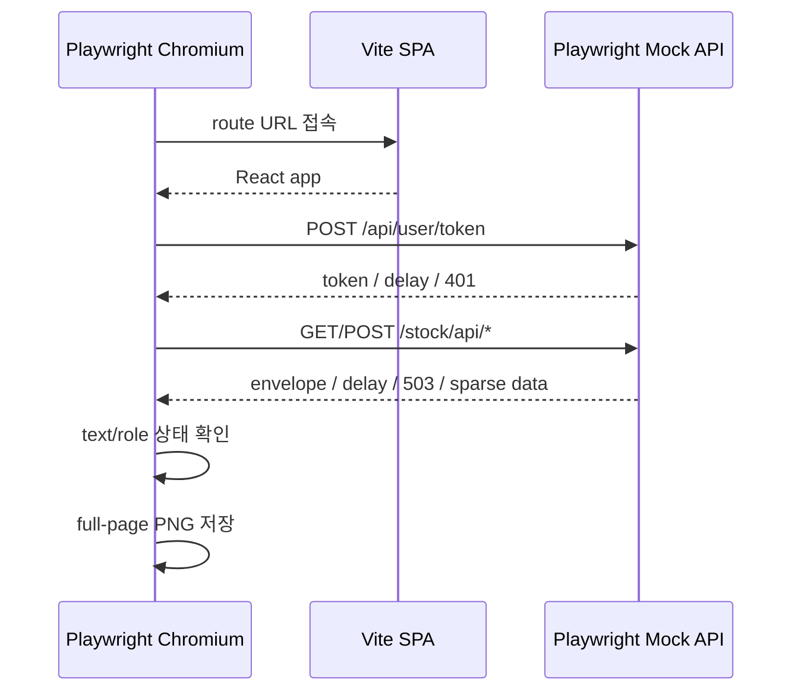

# Playwright + Mock API 캡처 가이드

## 1. 캡처 방식

`capture-screenshots.cjs`는 Playwright Chromium을 실행하고 `page.route('http://mock.api/**')`로 모든 backend 요청을 가로챈다.



실제 backend 프로세스나 외부 네트워크는 사용하지 않는다. 각 화면 URL의 `mock` query parameter는 route handler가 어떤 fixture를 반환할지 선택하는 캡처 전용 값이다.

## 2. 요구 사항

- Node.js
- `pnpm`
- Chromium을 포함한 `playwright` Node module

이 저장소 package.json에는 Playwright가 devDependency로 들어 있지 않다. 현재 환경에서는 전역 `@playwright/cli`가 가진 module을 아래처럼 사용했다.

```bash
export NODE_PATH="$(npm root -g)/@playwright/cli/node_modules"
```

프로젝트에 `playwright`를 이미 설치한 환경에서는 `NODE_PATH` 없이 실행할 수 있다.

## 3. 주 화면 1–38, 모바일 viewport 42–43

터미널 A:

```bash
VITE_API_HOST=http://mock.api \
VITE_APP_ENV=development \
pnpm dev --host 127.0.0.1 --port 4173
```

터미널 B:

```bash
NODE_PATH="$(npm root -g)/@playwright/cli/node_modules" \
CAPTURE_BASE_URL=http://127.0.0.1:4173 \
CAPTURE_MODE=app \
node docs/design_v2/capture-screenshots.cjs
```

모바일 실제 viewport만 다시 캡처:

```bash
NODE_PATH="$(npm root -g)/@playwright/cli/node_modules" \
CAPTURE_BASE_URL=http://127.0.0.1:4173 \
CAPTURE_MODE=mobile-overflow \
node docs/design_v2/capture-screenshots.cjs
```

서브에이전트 감사 증거 44–50:

```bash
NODE_PATH="$(npm root -g)/@playwright/cli/node_modules" \
CAPTURE_BASE_URL=http://127.0.0.1:4173 \
CAPTURE_MODE=audit-evidence \
node docs/design_v2/capture-screenshots.cjs
```

## 4. 프로덕션 인증 39–40

`VITE_APP_ENV=development`를 제거한 별도 Vite 프로세스가 필요하다.

```bash
VITE_API_HOST=http://mock.api \
pnpm dev --host 127.0.0.1 --port 4174
```

```bash
NODE_PATH="$(npm root -g)/@playwright/cli/node_modules" \
CAPTURE_BASE_URL=http://127.0.0.1:4174 \
CAPTURE_MODE=auth-production \
node docs/design_v2/capture-screenshots.cjs
```

redirecting 캡처에서는 앱이 상태를 그린 직후 실제 `/login`으로 떠나는 것을 막기 위해 Playwright가 Mock login navigation을 abort한다. 제품 코드는 변경하지 않는다.

## 5. 인증 설정 실패 41

```bash
VITE_API_HOST= \
pnpm dev --host 127.0.0.1 --port 4175
```

```bash
NODE_PATH="$(npm root -g)/@playwright/cli/node_modules" \
CAPTURE_BASE_URL=http://127.0.0.1:4175 \
CAPTURE_MODE=auth-config-error \
node docs/design_v2/capture-screenshots.cjs
```

## 6. Mock scenario 목록

| Scenario | 응답 |
| --- | --- |
| `ready` | 정상 market page |
| `market-partial` | Daily status PARTIAL |
| `market-failed-status` | Daily status FAILED지만 payload는 존재 |
| `market-empty-markets` | 정상 envelope, `markets: []` |
| `market-loading` | daily request 15초 지연 |
| `market-error` | daily API 503 |
| `archive-partial` | archive daily status PARTIAL |
| `archive-detail-loading/error` | archive detail 지연/503 |
| `archive-list-ready/empty/loading/error` | archive list 변형 |
| `cluster-ready/sparse/loading/error` | cluster detail 변형 |
| `batch-ready/empty` | batch list 변형 |
| `batch-list-loading/error` | jobs list 변형 |
| `batch-detail-loading/error` | selected detail만 변형 |
| `trigger-pending/error` | manual POST 지연/503 |
| `auth-loading` | token request 지연 |
| `auth-redirecting` | token 401 + login navigation abort |

## 7. 캡처 검증

스크립트는 screenshot 전에 각 상태의 고유 텍스트가 visible인지 기다린다. 따라서 API 응답만 도착하고 UI가 아직 렌더링되지 않은 이미지는 저장하지 않는다.

간단한 파일 검증:

```bash
find docs/design_v2/screenshots -maxdepth 1 -name '*.png' | wc -l
file docs/design_v2/screenshots/*.png
node --check docs/design_v2/capture-screenshots.cjs
```

예상 PNG 수는 50개다.

모바일 full-page 캡처 20/36의 폭이 862px인 것은 캡처 오류가 아니다. 390px viewport에서 table min-width와 레이아웃이 전체 문서 폭을 확장한 결과다. 42/43은 동일 화면의 390px viewport-only 증거다.

47의 1149px 폭과 48의 2135px 폭도 캡처 오류가 아니다. 긴 공백 없는 cluster/error 문자열이 각각 390px/1440px viewport보다 document width를 크게 확장한 현행 overflow 증거다.

## 8. Fixture 수정 원칙

- API envelope와 DTO field 이름은 `src/lib/api/types.ts`를 따른다.
- UI에 보이는 값은 매퍼를 통과한 결과이므로, fixture를 바꿀 때 `src/lib/mappers.ts` fallback도 확인한다.
- 캡처 전용 `mock` 파라미터를 제품 코드에 추가하지 않는다.
- loading은 timeout 전에 고유 메시지를 확인하고 캡처한다.
- 외부 기사 URL은 실제 접속하지 않으며 `example.com` 값만 사용한다.
