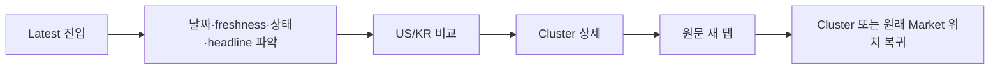
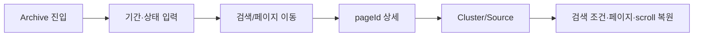
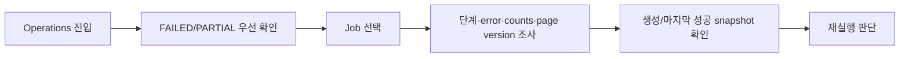
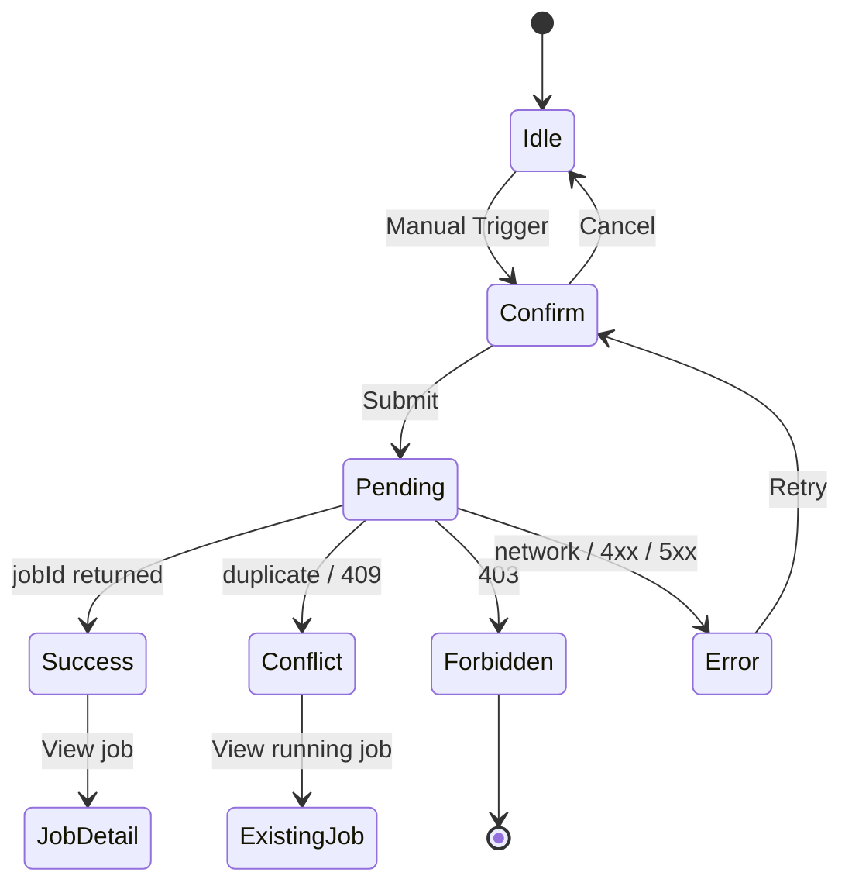

# 제품 목표·페르소나·사용자 여정

이 문서는 기존 `Product_Requirement_Document.md`, `Information_Architecture.md`, `Wireframe_Document.md`와 현재 코드를 대조해 디자인 v2가 해결해야 할 사용자 목표를 복원한다.

표의 “제안”은 아직 제품 책임자의 승인을 받지 않은 설계 가정이다. 디자인 Agent는 이를 사실로 고정하지 말고 결정이 필요한 항목으로 표시해야 한다.

## 1. 제품 목표

| 목표 | 사용자 가치 | 현재 요구 기준 | v2 디자인 기여 |
| --- | --- | --- | --- |
| 빠른 시장 파악 | 미국/한국 시장 흐름을 따로 찾지 않음 | 10~20초 내 핵심 분위기 파악 | 첫 viewport의 정보 우선순위, 두 시장 비교 |
| 과거 맥락 복원 | 특정 날짜의 시장·뉴스 맥락 재진입 | Archive 검색 후 snapshot 재현 | 검색 조건 보존, 날짜/version 문맥 |
| 근거 추적 | AI 요약에서 원문·관련 기사로 이동 | cluster와 article 연결 | 출처, 대표/관련 기사, 복귀 동선 |
| 운영 이상 탐지 | 실패·부분 실패·품질 저하를 즉시 인지 | 실패 원인 확인 100% | 상태 위계, master-detail, 관련 페이지 연결 |
| 안전한 재실행 | 중복/잘못된 날짜 실행 방지 | 동일 businessDate 동시 실행 금지 | 권한, 입력, confirm, 결과 추적 |

기존 시스템 KPI:

- 일일 배치 성공률 95% 이상
- 통합 페이지 생성 성공률 95% 이상
- 최신/날짜/Archive/Cluster API 평균 응답 2초 이내
- 미국 지수 3개, 한국 지수 2개 이상 권장
- 시장별 핵심 뉴스 2개 이상, 전체 4개 이상
- 통합 배치 20분 이내 목표

## 2. 핵심 페르소나

### A. 빠른 개요 파악 사용자

| 항목 | 내용 |
| --- | --- |
| 맥락 | 평일 하루 1회 이상 시장 개장 전후 또는 업무 시작 시 |
| 목표 | 미국/한국 분위기, 주요 지수, 핵심 이슈를 빠르게 파악 |
| 실패 비용 | 중요한 변화를 놓치거나 여러 뉴스 서비스에서 시간을 소비 |
| 최우선 정보 | 기준일, freshness, 생성 상태, global headline, 시장별 방향 |
| 주요 행동 | Latest → 시장 비교 → 관심 cluster → 원문 |

### B. 회고·탐색 사용자

| 항목 | 내용 |
| --- | --- |
| 맥락 | 주 3~5회, 특정 가격 움직임이나 과거 이슈 복기 |
| 목표 | 날짜를 찾고 그때 저장된 snapshot과 근거 기사를 재현 |
| 실패 비용 | 현재 정보와 과거 snapshot 혼동, 검색 조건 상실 |
| 최우선 정보 | business date, page/version, 당시 생성 상태, headline |
| 주요 행동 | Archive filters → pagination → pageId detail → cluster/source |

### C. 운영 확인 사용자

| 항목 | 내용 |
| --- | --- |
| 맥락 | 스케줄 배치 직후 또는 알림/장애 발생 시 수시 확인 |
| 목표 | 실패 단계·영향 범위·재실행 가능 여부를 빠르게 판단 |
| 실패 비용 | 중복 실행, 잘못된 날짜 재생성, 내부 로그 노출, 복구 지연 |
| 최우선 정보 | status, businessDate, duration, counts, error code/log, page version |
| 주요 행동 | Batch filter → failed job → detail → 관련 snapshot → rerun |

역할 간 목표가 충돌하면 아래 순서를 우선한다.

1. 운영 액션 안전성과 권한
2. snapshot 재현성·출처·상태 정확성
3. 핵심 과업 속도
4. 시각적 밀도와 장식

## 3. 역할·권한 결정

현재 구현은 인증 완료 후 모든 사용자에게 Market과 Operations를 함께 노출하고 `Admin.Ops`를 고정 표시한다. 기존 요구사항은 내부/개인 사용자 중심이면서 운영 로그를 일반 사용자에게 숨기고, 권한 없는 Operations 상태를 제공하도록 요구한다.

v2 기본 제안:

| 기능 | Market Viewer | Operator | 현재 코드 |
| --- | --- | --- | --- |
| Latest/Archive/Cluster 조회 | View | View | 모두 허용 |
| Batch summary/list | 숨김 또는 제한 | View | 모두 허용 |
| Batch detail log/error | 금지 | View | 모두 허용 |
| Manual Trigger | 금지 | Operate | 모두 허용 |
| force/rebuild 옵션 | 금지 | 별도 고권한 제안 | UI 없음, API type만 존재 |

반드시 결정할 사항:

- 단일 사용자 제품으로 유지할지 Viewer/Operator를 분리할지
- 권한 없는 메뉴를 숨김, disabled, 403 중 무엇으로 처리할지
- session expired와 permission denied를 별도 화면으로 구분할지
- 운영 로그에서 노출 가능한 error detail의 수준
- Manual Trigger와 force/rebuild에 서로 다른 권한이 필요한지

## 4. 여정 1 — Latest에서 근거 기사 확인

| 단계 | 사용자 행동 | 시스템 반응 | 유지할 상태 | 실패/대안 |
| --- | --- | --- | --- | --- |
| 1 | Latest 접속 | 가장 최근 snapshot 로드 | route, theme | auth/error 시 원인+Retry |
| 2 | headline·status 확인 | freshness와 PARTIAL 영향 설명 | 없음 | markets가 비면 생성 데이터 없음 설명 |
| 3 | 시장/cluster 선택 | 선택한 시장 문맥 유지 | market section 또는 tab | 긴 페이지에서는 section jump |
| 4 | Detail View | cluster deep link | origin route, scroll, snapshot date/pageId 제안 | 404/손상 시 원래 snapshot 복귀 |
| 5 | Original/Mirror | 안전한 URL을 새 탭에서 열기 | 현재 cluster state | 링크 실패 시 대체 링크/복사 |
| 6 | 복귀 | 진입한 Market과 scroll 위치 복원 | origin route + scroll | 직접 deep link면 같은 날짜 snapshot |

성공 기준: 사용자가 10~20초 안에 핵심 분위기를 말할 수 있고, 관심 이슈의 근거 기사까지 경로를 잃지 않고 도달한다.

## 5. 여정 2 — Archive 검색과 snapshot 재진입

| 단계 | URL/상태 | v2 전환 계약 |
| --- | --- | --- |
| 필터 draft | 아직 URL을 바꾸지 않음 | Apply 전 이동 시 draft 폐기 여부를 명확히 함 |
| Apply | `from`, `to`, `status`, `page=1` | validation 오류는 field inline, 첫 오류 focus |
| Pagination | 같은 query + `page` | 필터 유지, 결과 heading focus, scroll 기준 결정 |
| Detail | `/market/archive/:date?pageId=:id` | 검색 origin을 history로 유지 |
| Back | Archive query 복원 | filter, page, scroll 유지 |
| Direct detail link | origin 없음 | Archive 전체 검색으로 안전하게 이동 |

추가 예외:

- 미래 날짜
- from/to 역순
- page 범위 초과
- URL 날짜와 pageId의 businessDate 불일치
- 같은 날짜의 여러 version/pageId
- 결과가 없는 날짜에서 이전/다음 유효 날짜 탐색

## 6. 여정 3 — Batch 실패 조사

| 단계 | 사용자 질문 | 필요한 정보/액션 |
| --- | --- | --- |
| Summary | 현재 운영이 안정적인가? | 성공률, 실패 수, freshness, 집계 범위 |
| List | 어떤 날짜/작업이 문제인가? | status, businessDate, started/ended, counts |
| Detail | 어디서 왜 실패했나? | 단계, error code, log summary, retryability |
| Impact | 사용자 데이터에 어떤 영향인가? | 생성 pageId/version, 누락 범위, 마지막 성공 |
| Next | 재실행해야 하나? | rerun 조건, 관련 snapshot, runbook |

현재 FAILED 자동 선택은 유지할 수 있지만 이유를 텍스트로 알리고, URL `jobId` 또는 mobile drill-in으로 deep link할 수 있어야 한다.

## 7. 여정 4 — Manual Trigger lifecycle

Confirm에 필요한 정보:

- businessDate
- 기본 실행, `force`, `rebuildPageOnly` 중 실행 유형
- 이미 실행 중인 job 여부
- 예상 영향과 snapshot version 생성 여부
- 실행 권한

Success에 필요한 정보:

- 생성된 job ID와 status
- 시작 시각
- “View job” 액션
- 중복 제출을 막는 idempotency/disabled 정책

## 8. 측정 계획

기존 baseline은 계측되지 않았다. 아래 목표는 디자인 평가용 제안이며 제품 책임자가 승인해야 한다.

| 지표 | 측정 이벤트 | 제안 목표 | Guardrail |
| --- | --- | --- | --- |
| Latest 핵심 파악 시간 | 사용자 테스트에서 요약 응답까지 | 10~20초 | 상태/freshness 오인 0건 |
| Cluster 근거 도달 | detail → external source | 과업 성공 90% 이상 | 잘못된 날짜 문맥 진입 0건 |
| Archive 재진입 | filter apply → target page | 과업 성공 90% 이상 | Back 후 filter/page 상실 0건 |
| Batch 원인 확인 | failed row → 원인 설명 | 60초 이내 제안 | 일반 사용자 로그 노출 0건 |
| Trigger 추적 | confirm → job detail | 성공 사용자의 100% | 중복 실행 0건 |
| Mobile reflow | 320/390px visual QA | document overflow 0건 | 핵심 액션 손실 0건 |
| 접근성 | keyboard/axe/manual | blocker/critical 0건 | 200% zoom 과업 완료 |

