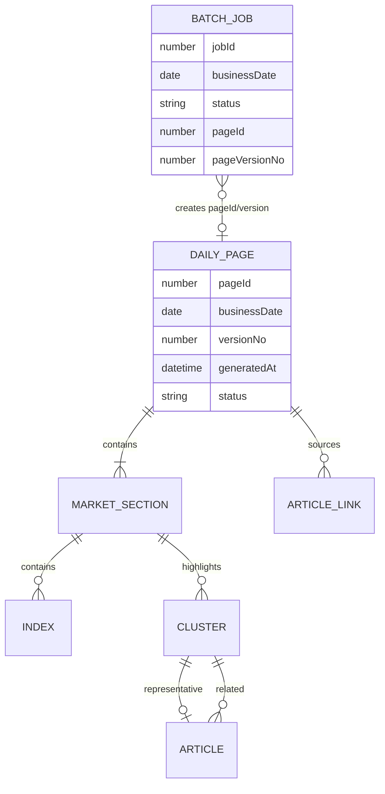

# 콘텐츠 모델·스트레스·UX Writing

## 1. 도메인 관계



중요한 UX 의미:

- `businessDate`는 시장 결과가 귀속되는 기준일이며 생성 시각이 아니다.
- 같은 `businessDate`에 여러 `pageId/versionNo`가 존재할 수 있다.
- Archive row는 pageId를 통해 특정 snapshot을 재현해야 한다.
- 날짜만으로 이동하면 그 날짜의 기본/최신 version을 받는다는 backend 정책 확인이 필요하다.
- Cluster는 Latest 또는 Archive snapshot 모두에서 진입할 수 있으므로 origin page/version 문맥이 필요하다.
- Batch detail의 pageId/version은 운영 원인과 사용자 화면을 연결하는 핵심 관계다.

## 2. 정보 우선순위

### Daily Page

| Priority | 콘텐츠 | 사용자 질문 | 빈 값 정책 |
| --- | --- | --- | --- |
| 1 | mode, businessDate, status, generatedAt | 현재인가, 과거인가, 신뢰 가능한가? | 화면 자체를 불완전 상태로 처리 |
| 2 | globalHeadline | 오늘 무엇이 중요한가? | 명시적 “헤드라인 미생성” |
| 3 | market summary/indices | 어느 시장이 어떻게 움직였나? | 시장별 partial/empty |
| 4 | clusters | 왜 움직였고 무엇을 더 볼까? | cluster 없음 설명 |
| 5 | article sources | 근거가 무엇인가? | 원문 없음/미러만 있음 구분 |
| 6 | metadata | 데이터가 얼마나 완전한가? | unknown으로 표시 |

### Batch Job

| Priority | 콘텐츠 | 사용자 질문 | 빈 값 정책 |
| --- | --- | --- | --- |
| 1 | status, businessDate, jobId | 어떤 작업이 문제인가? | 필수 |
| 2 | error/partial scope, stage | 어디서 왜 실패했나? | 구조화 정보가 없으면 raw log fallback |
| 3 | start/end/duration | 멈췄나, 끝났나? | null이면 RUNNING/unknown과 구분 |
| 4 | raw/processed/cluster counts | 영향 범위가 얼마인가? | 0과 unknown을 구분 |
| 5 | pageId/version | 어떤 사용자 snapshot이 생성됐나? | 생성 안 됨을 명시 |
| 6 | force/rebuild/audit | 어떻게 실행됐나? | Operator에게만 노출 |

## 3. 날짜·시간·숫자 정책

| 값 | 의미 | 표시 제안 |
| --- | --- | --- |
| Business Date | 시장 결과 기준일 | `2026-07-27` 또는 locale 날짜, label 항상 함께 |
| Generated At | snapshot 생성 완료 시각 | timezone 포함 또는 “KST” 명시 |
| Published At | 기사 발행 시각 | 날짜가 다르면 날짜+시간, 같으면 시간 중심 |
| Started/Ended At | batch 실행 구간 | 절대 시각 + duration |
| Last Updated | cluster/data freshness | 상대 시각은 tooltip에 절대 시각 병기 |

기존 PRD 기준 businessDate는 한국 시간(UTC+9)을 사용한다. 제품 기본 문서 언어는 한국어로 제안하며 `<html lang="ko">`가 필요하다.

숫자:

- 지수/등락률은 tabular numerals를 유지한다.
- `0`, `-`, `unknown`을 같은 의미로 사용하지 않는다.
- 상승/하락은 부호 + 텍스트/아이콘 + 색을 함께 사용한다.
- locale은 현재 날짜 `ko-KR`, 숫자 `en-US`가 혼용되므로 제품 정책으로 확정한다.
- job ID, UUID, status code, 브랜드는 `translate="no"` 후보로 둔다.

## 4. 상태 용어집

| 현재 용어 | 의미 | 사용자용 표현 제안 |
| --- | --- | --- |
| READY | snapshot 사용 가능 | 준비 완료 / 최신 |
| SUCCESS | batch 정상 종료 | 성공 |
| PARTIAL | 일부 소스/단계 누락, 사용 가능한 결과 존재 | 부분 완료 + 영향 범위 |
| FAILED | 결과 생성 또는 작업 실패 | 실패 + 다음 행동 |
| Source View | 같은 날짜·상태 Archive Search 이동 | 같은 날짜 기록 보기 |
| Detail View | cluster 상세 | 이슈 상세 보기 |
| Original Link | 원문 URL | 원문 보기 |
| Naver Mirror | 대체/미러 URL | 네이버에서 보기 |
| Page Version | 같은 날짜 snapshot version | 버전 |
| Business Date | 결과 귀속 날짜 | 기준일 |

PARTIAL은 chip만으로 끝내지 않는다.

```text
부분 완료
해외 뉴스 원문 15건이 지연되어 US Market의 기사 근거가 일부 누락되었습니다.
(사용 가능한 데이터 보기) (다시 시도)
```

## 5. 콘텐츠 길이와 배열 스트레스

API type에는 대부분 최대 길이/개수 제한이 없다. 디자인은 아래 등가군을 견뎌야 한다.

| 콘텐츠 | 최소 | 일반 | Stress | v2 표현 계약 |
| --- | --- | --- | --- | --- |
| Global headline | empty/null | 20~60자 | 200자 이상 | 2~3줄 우선, 전체 보기 제공 |
| Market title | empty fallback | 15~40자 | 120자 | heading wrap, 잘리지 않음 |
| Narrative | empty | 2~5문장 | 2,000자 | readable measure, 접기/펼치기 |
| Index list | 0 | US 3 / KR 2+ | 10+ | empty 설명, dense comparison |
| Cluster list | 0 | 시장별 2~5 | 20+ | progressive disclosure/virtualization 검토 |
| Cluster title | empty fallback | 20~60자 | 공백 없는 200자 | `overflow-wrap:anywhere` |
| Tags | 0 | 2~4 | 20+, 긴 영문 token | wrap + 최대 노출/더보기 |
| Articles | 0 | 3~10 | 50+ | pagination/virtualization |
| Publisher | null | 5~20자 | 100자 | fallback, wrap/truncate+accessible full text |
| Archive rows | 0 | page size 4 | 범위 초과 page | page validation |
| Batch rows | 0 | page size 20 | 100+ | pagination/cursor 필수 |
| Error code/log | null | 20~200자 | 4,000자, 공백 없는 token | code wrap, copy, expand |
| Job/UUID/URL | null/invalid | 고정 형식 | 매우 긴/깨진 값 | safe break, translate=no |

독립적으로 검증할 nullable 조합:

- 한 시장만 없음
- indices만 0, clusters만 0
- high/low만 null
- headline/summary만 null
- representative link만 invalid
- mirror만 존재
- articleCount와 실제 articles 길이 불일치
- batch endedAt/duration/pageVersion null
- status는 RUNNING이지만 현재 mapper가 FAILED로 내리는 경우
- rows, totalCount, pagination이 불일치

## 6. API 오류 등가군

모든 HTTP 상태를 다른 디자인으로 만들 필요는 없다. 사용자 행동이 달라지는 등가군은 분리한다.

| 등가군 | 예 | 사용자 메시지 | Primary action |
| --- | --- | --- | --- |
| Session | 401/token invalid | 세션 만료 | 로그인 |
| Permission | 403 | 접근 권한 없음 | 안전한 이전 화면 |
| Validation | 400/422 | 어떤 입력이 잘못됐는지 | 필드 수정 |
| Conflict | 409 duplicate job | 같은 날짜 작업 실행 중 | 기존 job 보기 |
| Rate limit | 429 | 잠시 후 가능, retry time | 기다렸다 재시도 |
| Temporary server | 500/502/503/504 | 일시 장애 + request ID | Retry |
| Offline/network | fetch failure | 연결/CORS/서버 불가 구분 가능한 범위 | 연결 확인/Retry |
| Malformed contract | invalid JSON/data 없음/success=false | 예상하지 못한 응답 | Retry/운영 문의 |
| Not found | 404 page/cluster/job | 대상이 없거나 삭제됨 | 목록/Latest |

오류 detail은 사용자 역할에 따라 다르다.

- Market Viewer: 안전한 요약, 다음 행동, request ID
- Operator: error code, validation path, log summary, retryability

## 7. UX Writing 원칙

- 문제, 영향 범위, 다음 행동 순서로 쓴다.
- “Unavailable” 같은 기술 용어만 사용하지 않는다.
- loading 문구는 `…`를 사용하고 작업 대상을 구체화한다.
- 버튼은 결과를 말한다: `Retry`보다 `시장 요약 다시 불러오기`.
- “이전 화면”처럼 목적지가 불명확한 label을 피한다.
- empty, error, permission, no-result를 같은 문구로 합치지 않는다.
- status code는 사용자 label과 함께 표시한다.
- AI 분석에는 생성 시각, source coverage, partial 여부를 인접하게 둔다.
- 원문과 mirror는 출처 우선순위와 실패 대안을 설명한다.

### 상태 문구 구조

```text
[상태 제목]
[무슨 일이 발생했는가]
[어떤 데이터/작업에 영향이 있는가]
[사용자가 지금 할 수 있는 일]
[request ID 또는 기술 detail — 역할에 따라]
```

