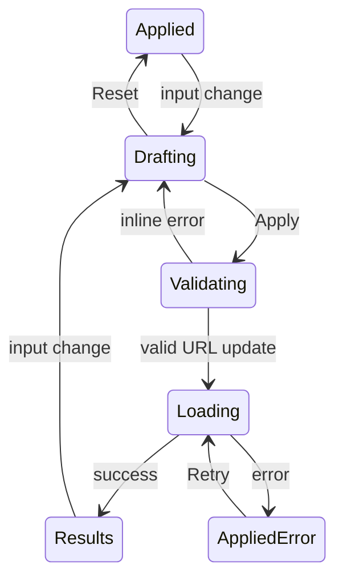

# 디자인 시스템 인벤토리·상호작용 계약

## 1. 현재 Foundation 인벤토리

| 영역 | 현재 | 문제/기회 |
| --- | --- | --- |
| Sans font | Inter → system fallback | 실제 font asset/preload 없음 |
| Display font | Manrope → system fallback | heading용 별도 family가 항상 보장되지 않음 |
| Type scale | `0.74rem`~`3.4rem` 개별 선언 | semantic token 없음 |
| Line height | 1.02, 1.15, 1.6, 1.7, 1.72 | 역할별 token 없음 |
| Numeric | 일부 `.numeric`만 tabular | 지수/KPI 전체로 확장 필요 |
| Spacing | 6, 8, 10, 12, 14, 16, 18, 20, 22, 24, 28, 32, 36px | scale 없이 분산 |
| Radius | 10, 14, 18, 24px | token 존재, pill 999px 별도 |
| Border | line / line-strong | semantic focus/divider 추가 필요 |
| Elevation | shadow-md / shadow-lg | sticky/overlay/dialog 단계 없음 |
| Motion | 주로 180ms transition, hover translate | reduced-motion 없음 |
| Icon | Lucide 14~34px | size/stroke/장식 여부 규칙 없음 |
| Layout | sidebar 272, topbar 72, content max 1440 | container/density token 부족 |
| Theme | light/dark semantic colors | persistence, theme-color, contrast 검증 부족 |

v2 foundation 산출물에 최소한 아래 token을 포함한다.

```text
color.bg / surface / surface-raised / overlay
color.text.primary / secondary / muted / inverse
color.border.default / strong / focus
color.intent.info / success / warning / danger + bg/border/text
font.body / label / heading / display / mono
font.size.* / lineHeight.* / weight.*
space.1…space.n
radius.sm/md/lg/full
shadow.raised/sticky/overlay/dialog
motion.duration.fast/base/slow
motion.easing.standard/enter/exit
layout.sidebar/header/content/gutter
zIndex.base/sticky/popover/drawer/dialog/toast
```

## 2. 현재 컴포넌트 인벤토리

| Component | Variants/States 현재 | v2 판정 |
| --- | --- | --- |
| Button | primary/secondary/ghost, default/icon, disabled | Refactor: loading/success/danger, focus, touch |
| Input | date/search, disabled | Refactor: validation/help/loading |
| Select | default/open/item/disabled | Reuse Radix, mobile/touch spec 추가 |
| Card | surface container | Refactor: 카드 남용 방지, semantic regions |
| Table | header/body/row/cell | Replace on narrow container |
| App navigation | sidebar + topbar duplicate | Replace |
| PageMessage | loading/error/empty 동일 틀 | Replace with state family |
| Status chip | success/partial/failed | Refactor: icon/text/detail link |
| Soft chip/Tag | neutral/tag | Refactor: overflow/selection 여부 |
| Index card | up/down | Refactor 또는 comparison table |
| Cluster card | summary/actions | Refactor: priority/source/freshness |
| KPI Stat card | success/primary/neutral | Refactor: range/freshness/definition |
| Filter bar | Archive/Batch 별도 | Compose shared filter pattern |
| Pagination | Archive Prev/Next | Extend: Batch와 range/error |
| Timeline card | article/source actions | Refactor: long list/density |
| Representative card | visual placeholder + actions | Refactor: source hierarchy |
| Master-detail | Batch 2-column | Responsive drill-in 필요 |
| Log box | plain text | Add code wrap/copy/expand |
| Skeleton | 없음 | Add |
| Inline alert | 없음 | Add |
| Toast | 없음 | Add, live region |
| Confirm dialog | 없음 | Add for trigger |
| Drawer/sheet | 없음 | Add for mobile nav/detail |
| Permission state | 없음 | Add |

각 v2 component는 최소 상태를 정의한다.

```text
default / hover / focus-visible / active / disabled
loading / empty / partial / error / retrying / success
light / dark / forced-colors
pointer / keyboard / touch
short / typical / long / unbroken content
```

## 3. v2 반응형 검증 폭

현재 breakpoint 1180/980/720은 구현 결과일 뿐 v2 요구가 아니다. v2는 viewport와 실제 component container 폭을 모두 기준으로 검증한다.

| Width | 필수 검증 |
| --- | --- |
| 320 | 최소 reflow, 400% equivalent 검증 |
| 390 | 주요 mobile 기준 |
| 720/768 | mobile→tablet 경계 |
| 980/1024 | navigation/master-detail 경계 |
| 1180/1280 | multi-column 데이터 경계 |
| 1440 | 기본 desktop |
| 1920 | max-width/밀도/빈 공간 |
| 844×390 | mobile landscape |

Pass 조건:

- document-level horizontal overflow 없음
- 중요한 액션이 overflow container 끝에 숨지 않음
- sticky header/aside가 focus target을 가리지 않음
- 200% zoom과 320 CSS px reflow에서 과업 완료
- safe-area inset을 고려

## 4. Navigation 상호작용

### Desktop

- primary navigation은 한 위치만 사용한다.
- 현재 route뿐 아니라 Cluster의 origin domain을 일관되게 활성 표시한다.
- Operations는 권한에 따라 숨김 또는 permission 설명을 제공한다.
- disabled Coming soon 링크를 primary navigation에 두지 않는다.

### Mobile

- compact header에서 현재 section과 global menu를 구분한다.
- drawer 사용 시 focus trap, Escape, overlay click, trigger focus return을 정의한다.
- bottom navigation을 선택하면 3~5개 핵심 목적지만 사용하고 safe area를 반영한다.
- menu open 상태를 URL에 넣을 필요는 없지만 browser Back을 가로채지 않는다.

## 5. URL·Back·Scroll·Focus 계약

| 전환 | URL | Back | Scroll | Focus |
| --- | --- | --- | --- | --- |
| primary route | pathname 변경 | 이전 route | 새 page top | h1, sticky offset |
| Archive filter | query 변경, page=1 | 이전 filter 복원 | results heading | result count/heading |
| Archive pagination | page query | 이전 page | results top | results heading |
| Archive detail | date + pageId | search query 복원 | 이전 scroll 복원 | detail h1 |
| Cluster detail | cluster ID + origin context 제안 | origin snapshot | origin scroll 복원 | detail h1 |
| external source | URL 변경 없음, 새 탭 | 현재 page 유지 | 유지 | 복귀 시 기존 link |
| Batch selection | `jobId` query 제안 | 이전 selection | detail visible | detail heading/region |
| mobile job detail | path/query drill-in | list/filter 복원 | selected row 위치 | detail h1 |
| Retry | URL 유지 | — | 영향 영역 유지 | 실패 시 alert, 성공 시 heading |
| theme | URL 불필요 | — | 유지 | toggle 유지 |

query-only 전환도 focus와 announcement를 가져야 한다. 현재처럼 pathname만 focus key로 사용하지 않는다.

## 6. Filter 계약



- draft와 applied filter를 시각적으로 혼동하지 않는다.
- Apply 전 URL은 바뀌지 않는다.
- validation은 from/to, 미래 날짜, 허용 status를 다룬다.
- loading/refetching 중 filter context와 이전 결과를 가능한 유지한다.
- 결과 수 변경을 `aria-live="polite"`로 한 번만 발표한다.
- Reset은 기본 날짜 범위와 page=1을 URL에 반영한다.

## 7. Batch Master-detail 계약

### Desktop

- row 전체 selection과 별도 navigation action 중 하나로 명확히 한다.
- selected, hover, focus, FAILED 상태가 서로 구분되어야 한다.
- detail panel 제목에 job ID/status를 포함한다.
- detail loading/error는 list와 filter를 제거하지 않는다.

### Mobile

- 760px table을 축소하지 않고 priority list로 바꾼다.
- row 선택 후 full-page/detail route 또는 sheet 중 하나를 선택한다.
- Back은 filter/page/scroll/selected row를 복원한다.
- error log, counts, page link, rerun action의 우선순위를 보장한다.

### Pagination

현재 batch query와 View Model에는 `page/totalPages`가 있으나 UI에는 이동 수단이 없다. v2는 pagination, cursor, load-more 중 하나를 반드시 제공한다.

- filter 적용 시 page=1
- 첫/중간/마지막/범위 초과 상태
- 20건 이상 결과 접근 가능
- page 변경 announcement/focus

## 8. Async announcement 계약

| 상태 | Visible UI | ARIA 제안 | Focus 이동 |
| --- | --- | --- | --- |
| initial loading | skeleton + 짧은 label | `role=status`, polite | 없음 |
| background refetch | 기존 데이터 + subtle progress | polite, 중복 방지 | 없음 |
| results updated | count/summary | polite | results heading |
| empty | 원인 + reset/alternative | region heading | empty heading |
| inline error | 영향 영역 + Retry | `role=alert` 또는 polite severity별 | alert/Retry 정책 |
| retrying | 해당 영역 progress | polite | 없음 |
| detail loading | detail skeleton | detail region busy | detail heading 유지 |
| selection changed | selected row + detail title | polite optional | keyboard action이면 detail |
| trigger pending | disabled submit + progress | polite | confirm submit 유지 |
| trigger success | job ID + View job | polite | success heading 또는 View job |
| trigger error | 원인 + Retry | alert | error summary |
| permission denied | 이유 + safe destination | main heading | h1 |

screen reader 문구는 시각 텍스트와 중복 발표되지 않도록 단일 live region을 사용한다.

## 9. 접근성 Foundation

- WCAG 2.2 AA를 목표로 한다.
- body text 4.5:1, large text/UI state 3:1 이상.
- 상태는 색만으로 전달하지 않는다.
- 모든 interactive target은 최소 44×44 CSS px 권장.
- icon-only control은 accessible name을 가진다.
- decorative icon은 보조기기에서 숨긴다.
- semantic landmark와 heading hierarchy를 화면별 annotation에 포함한다.
- page title은 `scroll-margin-top` 또는 `focus({preventScroll})` 정책을 갖는다.
- focus-visible은 light/dark/forced-colors에서 명확해야 한다.
- 200% zoom, 320px reflow, keyboard-only, screen reader flow를 검증한다.

## 10. Motion·Theme·Touch

- animation은 transform/opacity 중심이며 `transition: all`을 사용하지 않는다.
- `prefers-reduced-motion: reduce`에서는 위치 이동/장식 motion을 제거한다.
- 상태 변화는 motion 없이도 이해 가능해야 한다.
- theme toggle은 사용자 선택 저장 + system fallback을 제안한다.
- `color-scheme`과 `theme-color`를 양 테마에 맞춘다.
- date/select는 실제 touch device에서 검증한다.
- drawer/dialog는 `overscroll-behavior`, safe area, focus trap, Escape를 정의한다.
- hover에만 핵심 정보를 숨기지 않는다.

