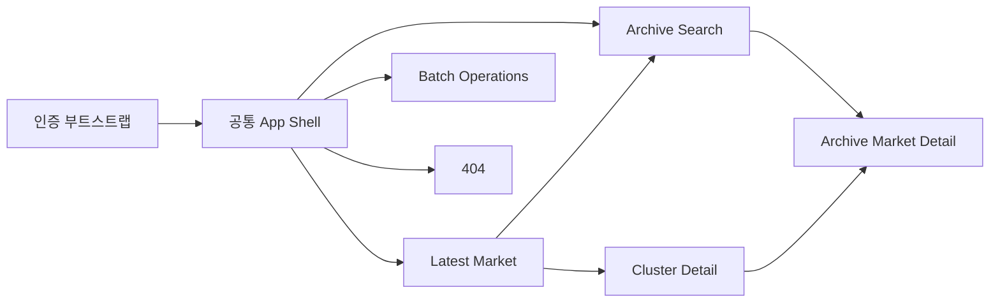
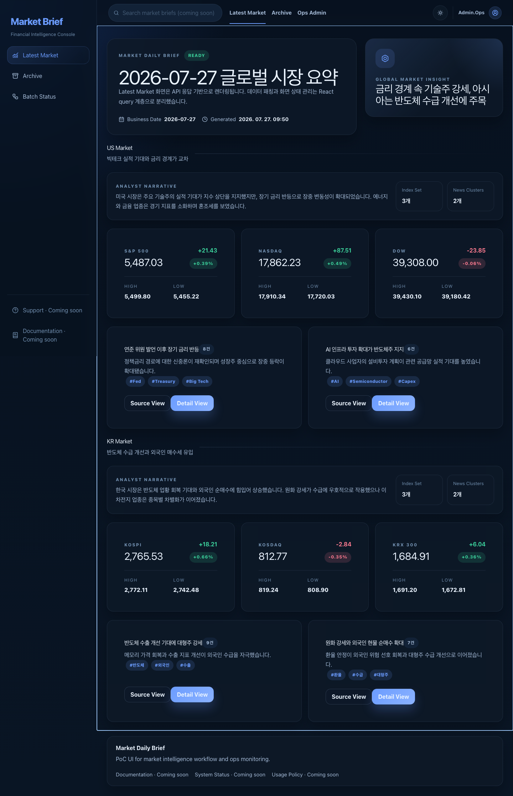
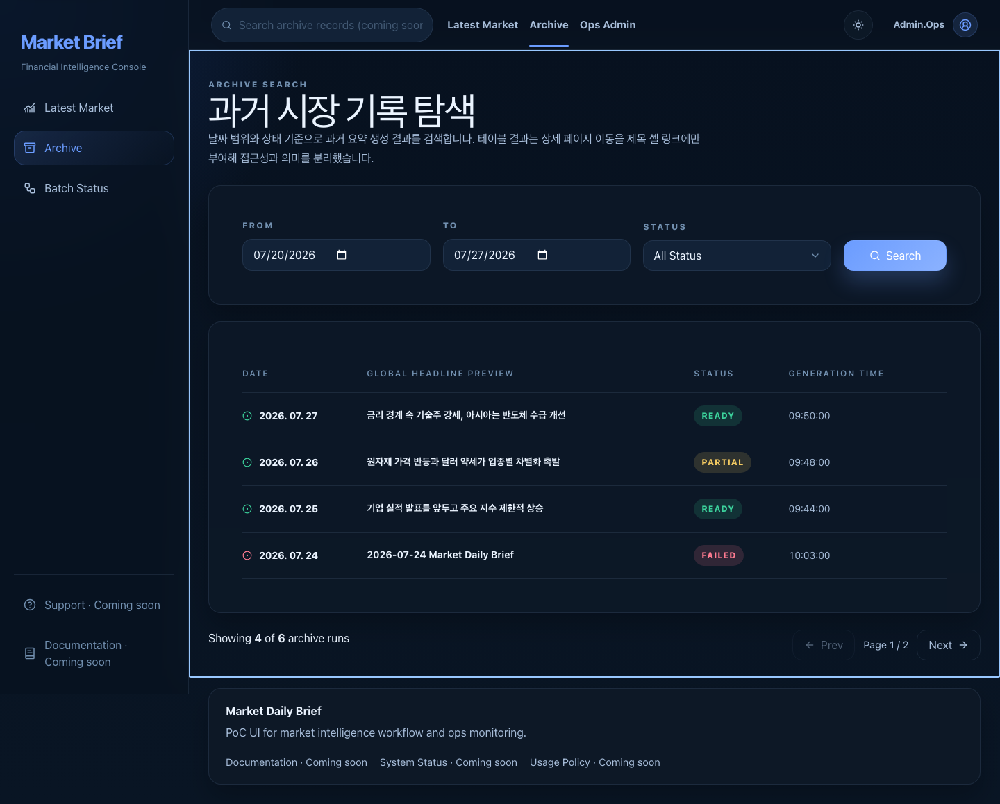
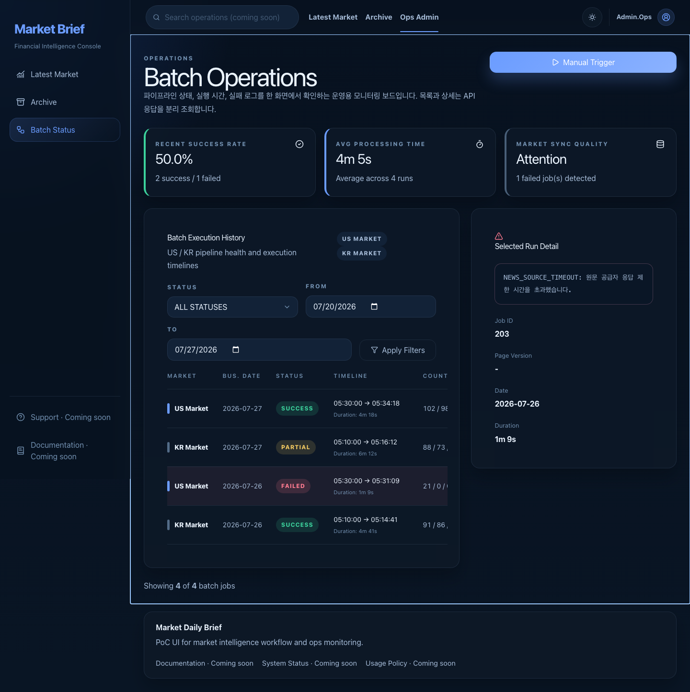

# Market Brief UI 재설계 인수인계 문서

이 디렉터리는 현재 `stockfront` UI를 코드와 실행 화면 양쪽에서 분석한 결과다. 디자인 전문 AI Agent가 기존 정보 구조, 화면 상태, 데이터 계약, 반응형 문제를 놓치지 않고 v2를 설계할 수 있도록 구성했다.

분석 기준일은 2026-07-27이며, 현재 코드는 Vite + React SPA, 커스텀 라우터, React Query, API DTO → View Model 매핑 구조다. 캡처 데이터는 실제 백엔드가 아니라 Playwright 네트워크 라우팅으로 만든 Mock API 응답이다.

## 문서 구성

| 문서 | 용도 |
| --- | --- |
| [01-ia.md](./01-ia.md) | 전체 IA 구조도, URL, 내비게이션, 화면 간 이동 |
| [02-wireframes.md](./02-wireframes.md) | 공통 셸과 모든 라우트의 데스크톱/모바일 와이어프레임 |
| [03-screen-state-matrix.md](./03-screen-state-matrix.md) | 정상·로딩·오류·빈 데이터·인터랙션·반응형 캡처 전수 목록 |
| [04-component-data-contract.md](./04-component-data-contract.md) | 컴포넌트 구조, API 계약, 상태 분기, 디자인 토큰 |
| [05-redesign-brief.md](./05-redesign-brief.md) | 현재 UX 이슈, v2 목표, 디자인 Agent용 요청문 |
| [06-playwright-capture-guide.md](./06-playwright-capture-guide.md) | Mock API/Playwright 캡처 재현 방법 |
| [07-current-ui-guideline-audit.md](./07-current-ui-guideline-audit.md) | 최신 Web Interface Guidelines 기준 코드/UX 감사 |
| [08-product-goals-personas-journeys.md](./08-product-goals-personas-journeys.md) | 제품 목표, 3개 페르소나, 권한, 4개 end-to-end 여정 |
| [09-scope-traceability-decisions.md](./09-scope-traceability-decisions.md) | 기존 요구↔현재 코드 추적, MVP 범위, 결정 로그 |
| [10-content-model-stress-writing.md](./10-content-model-stress-writing.md) | 도메인 관계, 콘텐츠 우선순위, 오류/장문/nullable 계약 |
| [11-design-system-interaction-spec.md](./11-design-system-interaction-spec.md) | 컴포넌트 인벤토리, responsive, focus/live-region 계약 |
| [12-acceptance-validation-handoff.md](./12-acceptance-validation-handoff.md) | 화면별 pass/fail, 산출물 DoD, 구현 QA matrix |
| [13-design-agent-implementation-prompt.md](./13-design-agent-implementation-prompt.md) | 코드 분석부터 UI v2 구현·Playwright 검증까지 요청하는 전달용 프롬프트 |
| [screenshots/](./screenshots/) | 50개 Playwright PNG 캡처 |
| [capture-screenshots.cjs](./capture-screenshots.cjs) | 캡처 및 Mock API 픽스처 |

## 한눈에 보는 서비스

핵심 사용자 작업은 다음 세 가지다.

1. 당일/과거 시장 요약과 지수, 뉴스 클러스터 파악
2. 날짜·상태로 과거 생성 결과 검색 후 상세 진입
3. 배치 실행 상태 확인, 실패 로그 조사, 수동 실행

## 대표 화면

| 최신 시장 | 아카이브 | 배치 운영 |
| --- | --- | --- |
|  |  |  |

## 재설계 시 먼저 해결할 항목

- 모바일에서 272px 사이드바 전체가 본문 위에 펼쳐져 핵심 정보 도달이 늦다.
- 아카이브/배치 테이블의 `min-width: 760px` 때문에 390px 화면에서 문서 전체 폭이 약 862px로 늘어나며, 데스크톱 배치 2열 패널에서도 마지막 열과 선택 액션이 초기 뷰 밖으로 밀린다.
- 동일한 3개 섹션 링크가 사이드바와 상단 바에 중복되어 정보 위계가 불분명하다.
- 전역 검색, Support, Documentation, System Status가 비활성 “Coming soon” 요소로 시각적 공간을 차지한다.
- 데이터 로딩은 스켈레톤 없이 중앙 메시지로 전체 콘텐츠를 대체하고, 오류 상태에 재시도 액션이 없다.
- `READY/PARTIAL/FAILED`와 `SUCCESS/PARTIAL/FAILED` 상태 체계가 화면마다 달라 공통 상태 언어가 필요하다.
- 배치 수동 실행은 진행/실패만 보이고 성공 확인, 작업 ID, 완료 알림이 없다.
- Batch API/View Model은 page를 가지지만 UI에 pagination이 없어 20건 이후 결과에 접근할 수 없다.
- 기존 요구는 Viewer와 Operator의 정보 노출을 구분하지만 현재는 모든 인증 사용자에게 로그와 Trigger를 노출한다.
- 최신 시장과 아카이브 상세은 같은 레이아웃인데, 화면 모드 차이가 제목 한 줄 외에는 약하다.

상세 근거와 권장 방향은 [05-redesign-brief.md](./05-redesign-brief.md)에 정리했다.

## 독립 검증 결과

3개 서브에이전트가 IA/사용자 여정, 상태·접근성, 디자인 핸드오프 관점으로 독립 검토했다.

- 기존 패키지는 현행 UI를 이해하고 1차 컨셉을 시작하기에는 충분했다.
- 역할/권한, end-to-end 여정, 기존 PRD와 현재 구현 차이, 콘텐츠 stress, interaction/accessibility, pass/fail 기준이 부족했다.
- 07~12 문서를 추가해 디자인 Agent가 임의로 결정할 영역과 제품/백엔드 확인이 필요한 영역을 분리했다.
- 50개 캡처는 “현행 렌더링 구조가 달라지는 대표 상태”와 키보드/320px/장문/pagination 감사 증거이며, v2에서 새로 설계할 403/409/refetch 등은 [12-acceptance-validation-handoff.md](./12-acceptance-validation-handoff.md)의 필수 variant로 관리한다.

## 분석 범위와 주의점

- 분석한 라우트는 `/market/latest`, `/market/archive/:date`, `/market/archive/search`, `/market/cluster/:uuid`, `/ops/batches`, 미정의 경로다.
- 인증은 보호 화면 밖의 `loading`, `redirecting`, `failed`를 포함했다.
- 데이터 성공, API 오류, 빈 목록/빈 섹션, 부분/실패 데이터, 상세 패널 로딩/오류, 트리거 진행/오류, 필터 팝오버를 캡처했다.
- `No Market Data`와 `No Cluster Data`는 컴포넌트 방어 분기로 존재하지만 현재 React Query 성공/오류 의미 체계와 매퍼를 통과하는 실제 API 응답만으로는 도달하기 어렵다. 이 차이는 상태 매트릭스에 별도 표시했다.
- 캡처 URL의 `mock` 파라미터는 Playwright 픽스처 선택용이며 제품 URL 계약에는 포함되지 않는다.
